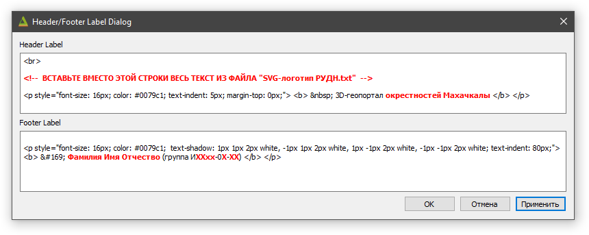
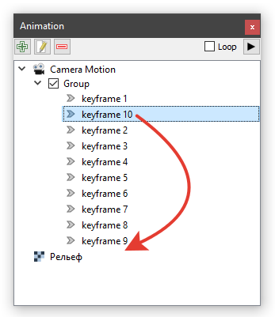
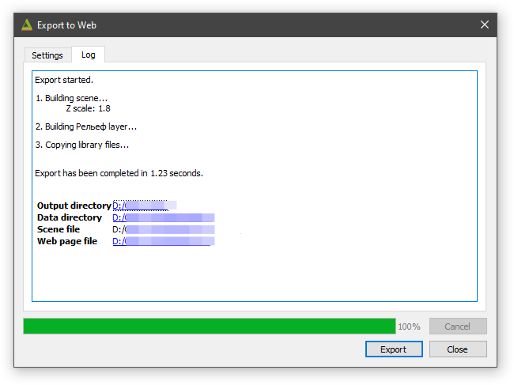
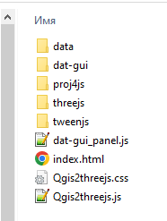
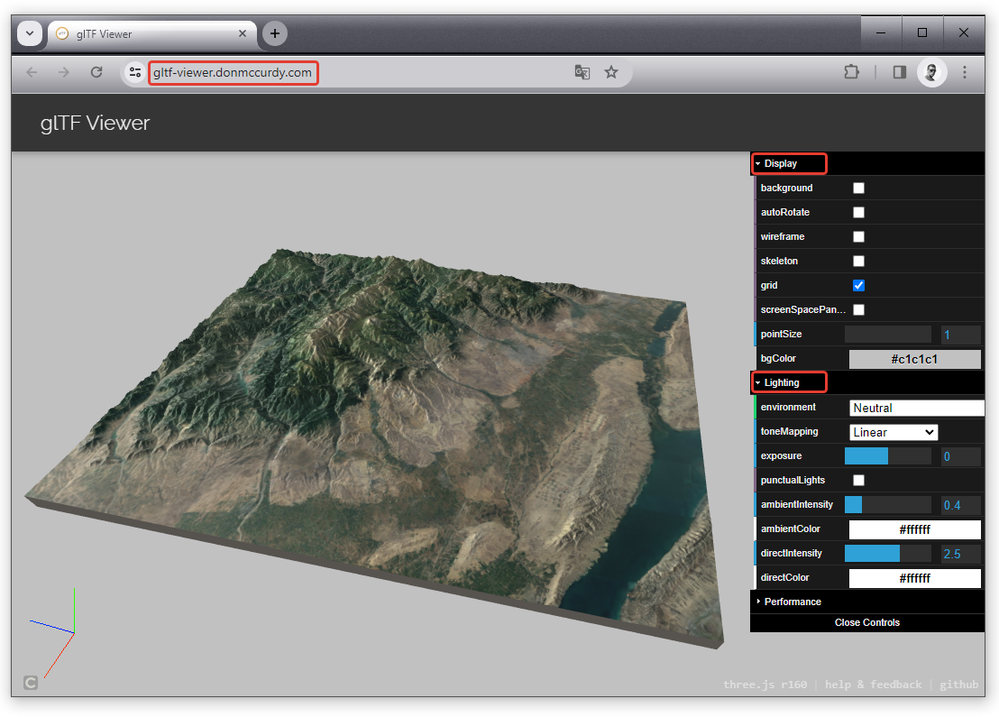

<!-- ВАЖНО: без "layout: default" локально не работает - сайт генерится, но без макета -->
<!-- А на GitHub, если есть любой пункт в заголовке, то сразу стр. 404. Нормально рендерится только когда вообще нет заголовка -->
Встречал еще какой-то tagline: Easy websites with GitHub Pages

С проблемностью title/description при разворачивании на GitHub нашел пока такой выход:  
Если самая первая строка в README.md «простой текст», а не заголовок, то title/description берутся из _config.yml

 
---------------------
- - - - - - - - - - -

## Процесс создания 3D-модели территории в QGIS и Qgis2threejs

**ВНИМАНИЕ !!!**

*Некоторые алгоритмы, которые будут задействованы в ходе лабораторной работы, с «русскими» папками НЕ работают !!!*

*Поэтому, при выполнении вами данной работы, имена всех файлов, а также пути к ним не должны содержать русских букв и пр. символов (кроме нижнего подчеркивания «_»).*

*Везде должны быть только английские буквы и/или цифры.*

**Разумеется нигде, не должно быть пробелов, точек, запятых и т.п.**

ОБЯЗАТЕЛЬНО проверьте, под какой учетной записью вы работаете на компьютере (ее имя).

*Как проверить: если у вас ОС Windows, то зайдите в папку «C:/Users/» («C:/Пользователи/») и посмотрите нет ли в ней папок (профилей пользователя) с названиями на русском языке.*

Если ее название (имя) на русском языке (например, "Евгений", "Мария" и т.п.), то функция «Export to Web» (создание html-веб-страницы с вашей 3D-моделью) работать не будет.

В этом случае, **СОЗДАЙТЕ на вашем компьютере новую (дополнительную) учетную запись на английском языке и работайте под ней.** Или работайте под своей обычной учетной записью, а «Export to Web» выполните из-под новой учетной записью (с именем на английском). С какими-либо другими действиями проблем возникать не должно.

**Создайте внутри папки «RUDN-QGIS-3D»** *(папку «RUDN-QGIS-3D» договорились разместить в корне диска «С:»)* отдельную директорию *(свою Рабочую папку)* и назовите ее «**Work_Dir**».

**Все создаваемые вами в ходе работы данные, помещайте только в вашу Рабочую папку.**

**Не «разбрасывайте» файлы с данными по всему компьютеру.**

\<=========================================================================\>

Запустите геоинформационную систему QGIS.

Откройте в программе QGIS заготовку Проекта «**Заготовка Проекта 3D.qgs**».

Добавьте в QGIS-проект цифровую модель рельефа (ЦМР) вашего района.

Для этого перетяните на основное окно программы QGIS (на окно карты) файл вашей ЦМР (например, файл «n37_e027_1arc_v3.tif», скаченный ранее с геопортала «EarthExplorer» или «30-Meter SRTM Tile Downloader»).

Центрируйте ЦМР в окне карты.

Для этого в Панели слоев щелкните правой клавишей мыши по названию слоя вашей ЦМР,  
а в открывшемся контекстном меню выберите «Увеличить до слоя».

Расположите слои в Легенде в следующем порядке, перетаскивая их в панели «Слои»:

Выделите в панели «Слои» слой ЦМР, щелкнув по его названию левой клавишей мыши.

Откройте панель «Стили», нажав кнопку  *(самая левая в панели «Слои»)*.

Измените способ отображения слоя ЦМР с «Одноканальное серое» на «Одноканальное псевдоцветное».

Настройте цветовое представление ЦМР таким образом, чтобы отображение рельефа местности вашего района в целом выглядело эффектно и визуально привлекательно, а имеющиеся на нем формы рельефа хорошо интерпретировались.

Для этого воспользуйтесь следующими возможностями и опциями настройки отображения одноканальных растровых слоев, имеющимися на панели «Стили»:

Выберите для представления рельефа красивый цветовой градиент (опция «Цветовой ряд» и имеющиеся в ней дополнительные настройки).

Измените опцию «Режим» со значения «Непрерывный» на «Равные интервалы» и подберите подходящее значение для соответствующей опции «Классы».

Более «тонкой» настройки стиля цветового представления ЦМР *(например, чтобы высота, соответствующая поверхности моря, показывалась голубым или синим)* можно добиться, изменяя Значение и Цвет для каждого отдельного класса.

\<=========================================================================\>

Установите и запустите модуль **Qgis2threejs**, нажав кнопку  в панели инструментов.

В открывшемся окне «**Qgis2threejs Exporter**» включите (активируйте) слой вашей цифровой модели рельефа (ЦМР) (в моем примере это «n37_e027_1arc_v3»):

Если поверхность «Flat Plane» («Плоская Плоскость») окажется включена, то отключите ее.

Перейдите в «Qgis2threejs Exporter» к меню «**Scene**» «**Scene Settings...**» и в появившемся окне задайте (введите) следующие опции:

Увеличение значения опции «**Z exaggeration**» (преувеличение по вертикали) с «**1.0**» до «**1.8**» сделает рельеф местности более выраженным (подчеркнутым).

Однако для некоторых территорий (например, молодые горы с большой крутизной склонов) рельеф при таком коэффициенте увеличения по вертикали может выглядеть неестественно.

В таких случаях, чтобы получить более предпочтительный результат, следует несколько уменьшить значение опции «Z exaggeration».

Изменение значения опции «**Coordinate Display**» на «Latitude and longitude» позволит, при определении координат интересующих точек и объектов на 3D-модели в браузере, получать их значения в привычном для большинства пользователей представлении: в географической системе координат (в географических градусах/минутах/секундах).

В блоке «**Base Extent**» выберите опцию/метод «**Fixed extent**», нажмите кнопку «**Select…**» и выберите в появившемся списке вариант «**Use Layer Extent…**» (использовать охват слоя).

В появившемся окошке выберите из ниспадающего меню название слоя вашей ЦМР (в моем примере это «n37_e027_1arc_v3»):

Проверьте опцию «**Fix aspect ratio to 1:1**». Если она окажется включена, то отключите ее.

Округлите значения параметров в ячейках «**Width**» и «**Height**» (задают размер 3D-модели по горизонтальным осям в метрах) до **1000** (тысяч метров) **в сторону уменьшения**.

Задав на панели «Scene Settings» необходимые опции и их значения, нажмите сначала кнопку «**Применить**» и, если результат в окне предпросмотра (Preview) вас устраивает, кнопку «**ОК**».

Откройте в «Qgis2threejs Exporter» меню «Scene» и выберите подменю/действие «**Reload**».

В результате 3D-модель пересчитается и сцентрируется в окне предпросмотра (Preview),  
а ее границы будут совпадать с границами слоя (тайла) вашей ЦМР.

\<=========================================================================\>

В окне «Qgis2threejs Exporter» щелкните правой клавишей мыши по имени слоя вашей ЦМР и выберите в открывшемся контекстном меню пункт «**Properties...**».

На закладке «**Main**» появившейся панели, в блоке «**Material**», выделите текстурирующее ЦМР изображение «**map (canvas)**» и удалите его, нажав кнопку  .

*Справочно:*

*Изображение «map (canvas)» — это то, что отображается в основном окне карты QGIS в данный момент. При грамотном обращении им очень полезно пользоваться: меняя порядок ГИС-слоев и переключая их видимость, можно легко сформировать  
необходимое комбинированное текстурирующее ЦМР изображение.*

Добавьте для вашей 3D-модели последовательно три текстурирующих ЦМР изображения.

Для этого в блоке «Material» нажмите кнопку  и выберите в появившемся списке вариант «**Select Layer(s)…**». В открывшемся меню поставьте галочку в чек-боксе напротив имени слоя «Космоснимки Google» и нажмите кнопку «**OK**».

Аналогичным образом добавьте для 3D-модели в качестве текстурирующих изображений слой «Карта OpenTopoMap» и слой вашей ЦМР.

В блоке «Material» измените название слоя ЦМР на «Цветной рельеф».

*Для переименования сделайте двойной клик левой клавишей мыши по названию слоя ЦМР.*

Нажмите внизу панели «Layer Properties» кнопку «**Применить**».

*Кнопку «***ОК***» не нажимайте – оставьте панель открытой.*

Перейдите на панели «Layer Properties» на закладку «**Others**» и задайте следующие опции:

Опция «**Altitude of bottom**» определяет положение по вертикали основания (днища) формируемой 3D-модели (в метрах) и, соответственно, высоту ее боковых сторон.

По умолчанию это значение равно «0», что соответствует уровню мирового океана (правильнее - поверхности общемирового эллипсоида WGS-84), и в ряде случаев оно не будет оптимальным. Очень часто возникает необходимость изменить (отрегулировать) высоту боковых сторон 3D-модели с тем, чтобы модель выглядела изящнее (эстетичнее).  
Это легко сделать, изменив значение параметра «Altitude of bottom» на более подходящее. При этом значения могут быть как положительными (основание модели смещается над поверхностью мирового океана вверх), так и отрицательными (в этом случае основание модели как бы опускается ниже поверхностью мирового океана).

Задав на закладке «Others» необходимые опции, нажмите кнопку «**Применить**».

Убедившись, что высота боковых сторон 3D-модели вас устраивает, нажмите кнопку «**ОК**».

\<=========================================================================\>

Включите в создаваемый вами **3D-геопортал** дополнительные элементы оформления.

А) Добавьте стрелку, указывающую направления на север.

Перейдите в меню «**View  Widgets  North Arrow...**».

Поставьте галочку в чек-боксе «Enable North Arrow».

Выберите цвет для добавляемой в 3D-геопортал стрелки-указателя направления на север.

Нажмите кнопку «**Применить**». В нижнем левом углу окна «Qgis2threejs Exporter» появится трехмерная стрелка севера, которая будет синхронизирована с 3D-моделью местности.

Если результат (цвет стрелки) вас устраивает, нажмите кнопку «**ОК**».

Б) Добавьте верхний и нижний колонтитулы.

Перейдите в меню «**View  Widgets  Header/Footer Labels...**».

Внесите (впишите) для верхнего колонтитула информацию о географическом названии территории вашей модели.

А для нижнего колонтитула - вашу Фамилию Имя Отчество (и код группы в скобках).

Нажмите кнопку «Применить». Если результат вас устраивает, нажмите кнопку «ОК».

*Рекомендация:*

*Если у вас возникает желание оформить текст колонтитулов красиво, то сделать это можно с помощью HTML-синтаксиса.*

*Необходимые заготовки находятся в папке «Колонтитулы» (папка расположена в директории «004 \_ Процесс создания 3D-модели в QGIS и Qgis2threejs»).*

*1) Скопируйте весь текст/код из файла «Колонтитул верхний (Header Label).txt» и вставьте его в верхний колонтитул (Header Label).  
Измените текст «окрестностей Махачкалы» на название территории вашей 3D-модели.*

*2) Скопируйте весь текст/код из файла «Колонтитул нижний (Footer Label).txt» и вставьте его в нижний колонтитул (Footer Label).  
Конечно, отредактируйте текст, корректно указав ваши ФИО и номер вашей группы.*

*3) Чтобы поместить в верхний колонтитул логотип РУДН, скопируйте весь текст/код из файла «Логотип РУДН в SVG.txt» и замените им имеющуюся в верхнем колонтитуле строку* **"\<!-- ВСТАВЬТЕ ВМЕСТО ЭТОЙ СТРОКИ ВЕСЬ ТЕКСТ ИЗ ФАЙЛА "SVG-логотип РУДН.txt" --\>"***.*

\<=========================================================================\>

**Окончательные настройки 3D-модели перед экспортом в веб-страницу**

Еще раз откройте панель «Layer Properties» в которой задаются многие важные свойства как самой ЦМР, так и текстурирующих ее изображений (слоев).

Для этого в «Qgis2threejs Exporter» щелкните правой клавишей мыши по названию слоя вашей ЦМР (теперь, после переименования оно должно быть «Рельеф») и выберите в открывшемся контекстном меню пункт «**Properties...**».

*Или можно просто сделать двойной клик левой клавишей мыши по слову «Рельеф».*

В открывшейся панели, в блоке «**Geometry**», установите для параметра «**Resampling level**» *(определяет детальность рельефа итоговой 3D-модели)* значение «**6**» переместив движок потенциометра в крайнее правое положение.

В блоке «**Material**» выделите текстурирующее ЦМР изображение «Космоснимки Google» и задайте (увеличьте) его детальность (разрешение). Для этого установите для расположенной ниже опции «**Image width (px)**» значение «**4096**», выбрав его их из раскрывающегося списка.

Аналогичным образом установите значение опции «Image width (px)» для текстурирующего изображения (слоя) «Карта OpenTopoMap» на «**2048**», а для «Цветной рельеф» — на «**4096**».

Задав необходимые значения указанных опции, нажмите кнопку «**ОК**» внизу панели.

В «Qgis2threejs Exporter» щелкните левой клавишей мыши по названию текстурирующего изображения (слоя) «**Космоснимки Google**». После чего 3D-модель в окне «Preview» будет текстурирована слоем «Космоснимки Google». Для 3D-модели слой «Космоснимки Google» станет «основным» и именно этим слоем (изображением) будет текстурирована 3D-модель при открытии ее веб-станицы в браузере.

*Важная рекомендация:*

*Если вы посчитаете целесообразным выполнить какие-либо коррекции/изменения заданных значений/опций (например, изменить значение параметра «Altitude of bottom»), то  
для ускорения перерисовки 3D-модели в окне Qgis2threejs Exporter имеет смысл временно уменьшить значения опций, определяющих детальность формируемой модели.*

*Для этого Установите движок параметра «Resampling level» в положение «***1***» или «***2***»,   
а для опции «Image width (px)» выберите из списка значение «***512***» или «***1024***».  
Когда вы определитесь со всеми прочими установками и настройками, то перед созданием/экспортом финальной 3D-модели для получения ее наилучшего качества, верните значения двух указанных выше параметров к максимальным.*

Вращая в окне «Preview» 3D-модель вокруг своей оси и приближая/отдаляя ее с помощью мыши и клавиатуры, найдите для нее красивый эффектный ракурс. Он будет определять начальное положение и ориентацию 3D-модели при открытии ее веб-станицы в браузере.

*При этом перемещать модель по горизонтали и/или вертикали не следует (вернее, крайне нежелательно) – это приведет к нежелательным эффектам при управлении 3D-моделью в браузере из-за смещения «центра тяжести» модели.*

*Подробности по управлению моделью смотрите в документе «Инструкция - Как работать с 3D-моделью в браузере.pdf» расположенном в папке «005 \_ Как работать с 3D-результатом в браузере - инструкция».*

\<=========================================================================\>

**Создайте анимацию пролета над территорией вашей 3D-модели**

Усовершенствуйте веб-страницу вашей 3D-модели, создав красивую и эффектную анимацию пролета над ее территорией.

Для этого в «Qgis2threejs Exporter», не изменяя уже выбранного вами начального ракурса 3Dмодели, в панели «**Animation**» щелкните левой клавишей мыши по «**Camera Motion**» и нажмите кнопку  . В результате создастся группа с названием «Group», которая будет объединять ключевые кадры (ракурсы) создаваемой вами анимации. При этом в группу сразу добавится ключевой кадр с названием «keyframe 1», который будет фиксировать выбранный вами начальный ракурс 3D-модели в качестве стартового для вашей анимации.

Детально продумайте маршрут и схему движения (виртуального пролета) над поверхностью вашей 3Dмодели. перемещая и поворачивая 3D-модель в окне предпросмотра (Preview).

Задействуйте при этом все имеющиеся возможности управления моделью и ее перемещения (с помощью мыши и клавиш со стрелками на клавиатуре в комбинации с клавишами «Shift» и «Ctrl»).

Последовательно перемещаясь по разработанному вами маршруту пролета, зафиксируйте ориентировочно от восьми до девяти ключевых кадра *(keyframe, ракурса)* создаваемой вами анимации, каждый раз нажимая кнопку  в панели «Animation».

При этом необходимо выбрать *(желательно в середине пролета)* и задать ключевой кадр (**стоп-кадр**), при котором внимание зрителя будет сфокусировано на каком-либо знаковом, наиболее важном для данной территории географическом объекте (населенном пункте, горной вершине, леднике, каньоне и т.п,).

На панели «Animation» щелкните в группе ключевых кадров левой клавишей мыши по первому (стартовому) ключевому кадру «keyframe 1» и нажмите кнопку  .

Ниже «keyframe 1» создастся новый ключевой кадр, которому будет соответствовать точно такой же ракурс, как и у первого ключевого кадра анимации. Перетяните вновь созданный ключевой кадр вниз, сделав его самым последним в списке.

 

Таким образом самый первый (стартовый) и самый последний ключевые кадры анимации будут совпадать (иметь одинаковые ракурсы), а анимация виртуального пролета вернется в конце в начальную точку.

Если возникнет необходимость откорректировать ракурс, соответствующий какому-либо ключевому кадру, то сделать это можно достаточно просто. Для этого на панели «Animation» щелкните в группе ключевых кадров левой клавишей мыши по ключевому кадру, ракурс для которого необходимо скорректировать.

Аккуратно перемещая и поворачивая 3D-модель в окне предпросмотра (Preview), установите новый (лучший) ракурс для данного ключевого кадра.

Откройте контекстное меню для текущего ключевого кадра, щелкнув по его названию в группе ключевых кадров правой клавишей мыши.

В появившемся списке выберите подменю/действие «**Set current view to this keyframe...**» и подтвердите действие:

Удалить ключевые кадры, которые после просмотра анимации вы посчитаете лишними, также можно через его контекстное меню соответствующего ключевого кадра. Откройте контекстное меню ключевого кадра и выберите подменю/действие «**Remove…**».

Для выбранного вами ранее **стоп-кадра**, сфокусированного на наиболее важном для данной территории географическом объекте, создайте соответствующее «Повествовательное содержание». Через контекстное меню этого ключевого кадра перейдите к «**Edit…**».

В открывшейся панели в блоке «**Narrative content**» *(Повествовательное содержание)* создайте (наполните) содержимое вашего стоп-кадра в html-формате.

Необходимые html-заготовки, позволяющие сделать для стоп-кадров красивое оформление, находятся в папке «**Шаблоны для Narrative content в анимации**» *(папка расположена в директории «004 \_ Процесс создания 3D-модели в QGIS и Qgis2threejs»)*.

Имеющаяся в блоке «Narrative content» кнопка  позволяет добавить к вашему оформлению стоп-кадра *(в текущую позицию курсора)* изображение, хранящееся локально на компьютере.

Путь к файлу изображения может представлять собой и полный путь к файлу изображения, размещенного в сети интернет (см. рисунок выше).

*Важная особенность:*

*Если изображение размещено в интернет, и в блоке «Narrative content» вы прописываете полный путь (веб-ссылку)* *к нему, то, при формировании вашей html-веб-страницы с 3Dмоделью, эта веб-ссылка запишется в файл «index.html». Соответственно, если ссылка на данное изображение будет изменена владельцем ресурса или изображение будет и вовсе им удалено, то оно, разумеется, перестанет отображаться и на вашей html-веб-странице с 3D-моделью.*

*Но если вы добавляете изображение, хранящиеся на вашем компьютере* *локально, то, при формировании html-веб-страницы с 3D-моделью, изображение будет скопировано в папку \\data\\index\\img. Таким образом изображение станет неотъемлемой частью вашей html-веб-страницы, будет находиться под вашим полным контролем (в том числе включая возможность его редактирования) и не исчезнет по независящим от вас причинам и обстоятельствам.*

*Таким образом, более надежный и правильный вариант: скачать необходимое вам изображение из интернет локально на компьютер и уже его добавлять в оформление вашего стоп-кадра.*

Увидеть и проверить, как будет выглядеть ваше оформление наполнения стоп-кадра, можно нажав соседнюю кнопку  . При этом закрывать окно настройки анимации не требуется.

*Шаблон №3, например, создает оформление стоп-кадра следующего вида и наполнения:*

\<=========================================================================\>

**Экспорт 3D-модели в веб-страницу (3D-геопортал)**

Откройте в «Qgis2threejs Exporter» меню «**File** **Export to Web...**».

В появившемся окне в пункте «Output directory» задайте путь к заблаговременно созданной вами отдельной папке, в которую вы сохраните html-веб-страницу с вашей 3D-моделью,  
а также задайте следующие опции:

*Текст, вписанный вами для опции «Page Title» (в моем примере это «Махачкала»), будет отображаться как название веб-страницы (на закладке) при ее открытии в браузере.*

Не изменяйте опцию «**HTML filename**», оставив для нее значение «**index.html**».

Нажмите кнопку «**Export**».

После завершения процесса откроется закладка «**Log**», на которой *(если все прошло успешно)* будут перечислены выполненные модулем Qgis2threejs действия и отобразятся ссылки/пути к итоговым результатам:

А в указанной вами папке сформируется файловая структура (файлы и директории) вида:

Для открытия 3D-модели в браузере достаточно сделать здесь двойной щелчок мышью на файле «**index.html**».

*3D-модель откроется в браузере, являющимся на вашем компьютере браузером по умолчанию.*

В меню в верхнем правом углу веб-страницы, перейдя к «Layers Рельеф **Material**», вы сможете легко переключать текстурирующие рельеф изображения, выбирая из списка необходимые слои.

А перейдя к меню «Animation **Play**» вы сможете запустить созданную вами анимацию.

\<=========================================================================\>

**Опубликуйте созданную вами 3D-модель в Интернет**

Зарегистрируйтесь на сервисе для публикации и размещения статических сайтов **Netlify**,

перейдя по ссылке <https://app.netlify.com>.

Загрузите на хостинг html-веб-страницу с вашей 3D-моделью.

*Сделать это можно простым перетягиванием папки, в которую вы сохранили html-веб-страницу, на открытую в браузере страницу хостинга Netlify.*

После завершения загрузки данных и появления на сервисе ссылки на ваш готовый сайт с 3Dмоделью, переименуйте сайт так, чтобы ссылка на него была более удобочитаемой.

Для этого зайдите в раздел «Site configuration» вашего сайта, найдите кнопку «Change site name» и выполните переименование. Необходимо иметь в виду, что старая ссылка работать, конечно, перестанет.

Теперь вы можете продемонстрировать результаты своей работы кому пожелаете, просто переслав html-ссылку на ваш сайт (3D-web-портал).

Сгенерируйте html-ссылку на ваш сайт с 3D-моделью, переименуйте ее и отправьте ссылку  
в личный чат преподавателя в MS Teams для проверки результата вашей работы.

\<=========================================================================\>

**Экспортируйте вашу 3D-модель в обменный формат glTF**

Откройте меню «**File** **Save Scene As  glTF (.gltf, .glb)...**» и в появившемся окне задайте имя создаваемого gltf-файла и путь к нему.

Откройте созданный файл в программе для визуализации 3D-моделей формата gltf  
*(дистрибутив программы имеется в одноименной папке облачного ресурса с учебными материалами)* и поэкспериментируйте с опциями, влияющими на визуализацию модели и режимы ее освещения.

*В ОС Windows 10 и 11 у вас уже может быть предустановлено «Средство 3D-просмотра», открывающее 3D-объекты форматов* **gltf** *и* **glb** *по умолчанию.*

\<=========================================================================\>

