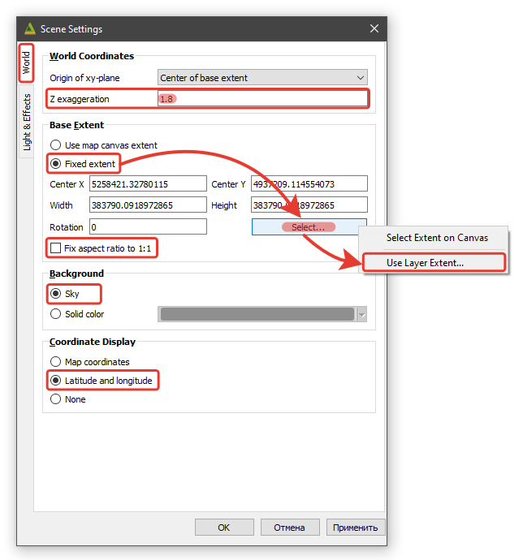
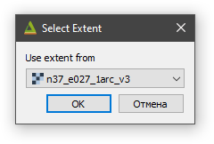
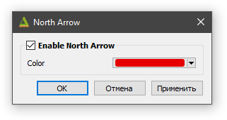
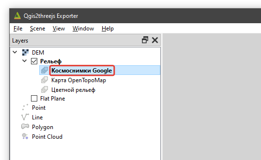
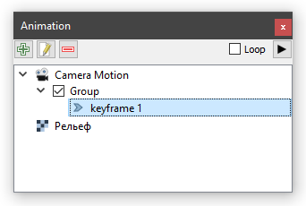

<!-- ВАЖНО: без "layout: default" локально не работает - сайт генерится, но без макета -->
<!-- А на GitHub, если есть любой пункт в заголовке, то сразу стр. 404. Нормально рендерится только когда вообще нет заголовка -->

Встречал еще какой-то tagline: Easy websites with GitHub Pages

С проблемностью title/description при разворачивании на GitHub нашел пока такой выход:  
Если самая первая строка в README.md «простой текст», а не заголовок, то title/description берутся из _config.yml

 

 <!-- двойная разделительная линия ======================================================== -->

<!-- TOC -->

### ОГЛАВЛЕНИЕ
- [Выбор варианта работы](#выбор-варианта-работы)
- [Процесс создания 3D-модели в QGIS и Qgis2threejs](#процесс-создания-3d-модели-в-qgis-и-qgis2threejs)
- [Запустите геоинформационную систему QGIS](#запустите-геоинформационную-систему-qgis)

- [НУЖНО КАК-ТО ОЗАГЛАВИТЬ](#нужно-как-то-озаглавить)

- [Добавление дополнительных элементов оформления](#добавление-дополнительных-элементов-оформления)
- [Окончательные настройки 3D-модели перед экспортом в html](#окончательные-настройки-3d-модели-перед-экспортом-в-html)
- [Создание анимации пролета над поверхностью 3D-модели](#создание-анимации-пролета-над-поверхностью-3d-модели)
- [Экспорт 3D-модели в html-веб-страницу 3D-геопортала](#экспорт-3d-модели-в-html-веб-страницу-3d-геопортала)
- [Опубликуйте созданную вами 3D-модель в интернет](#опубликуйте-созданную-вами-3d-модель-в-интернет)
- [Экспортируйте вашу 3D-модель в обменный формат glTF](#экспортируйте-вашу-3d-модель-в-обменный-формат-gltf)
 

- [4. Dati di esempio](#4-dati-di-esempio)
	- [5. Videotutorial](#5-videotutorial)
	- [5. Videotutorial](#5-videotutorial)
		- [Qgis Processing plugin](#qgis-processing-plugin)
		- [Qgis Processing plugin](#qgis-processing-plugin)
- [6. Ringraziamenti](#6-ringraziamenti)

<!-- /TOC -->

## Выбор варианта работы

выбранной вами территории (или на район в соответствии с вашим вариантом по номеру в списке группы),

[Ссылка на страницу выбора «стандартного» варианта работы (по номеру в списке группы)](./materials/variants_of_work.html)

## Дополнительные сервисы космоснимков

Скачать QLR-файл (QGIS Layer Definition File, описание слоя) «Дополнительные сервисы космоснимков.qlr» можно по 
   <a href="./materials/Дополнительные сервисы космоснимков.qlr" 
      title="Ссылка для загрузки файла «Дополнительные сервисы космоснимков.qlr»" >
      <!-- target="_blank" я ЗАКОММЕНТИЛ - без него не происходит лишнего "взмигивания страницы". ">" пришлось перенести в строку выше-->
      <b>ссылке</b></a> .
  

## Процесс создания 3D-модели в QGIS и Qgis2threejs

**ВНИМАНИЕ !!!**

*Некоторые алгоритмы, которые будут задействованы в ходе лабораторной работы, с «русскими» папками НЕ работают !!!* \
*Поэтому, при выполнении вами данной работы, имена всех файлов, а также пути к ним не должны содержать русских букв и пр. символов (кроме нижнего подчеркивания «_»).* \
*Везде должны быть только английские буквы и/или цифры.* \
***Разумеется нигде, не должно быть пробелов, точек, запятых и т.п.*** \
\
ОБЯЗАТЕЛЬНО проверьте, под какой учетной записью вы работаете на компьютере (ее имя). \
***Как проверить:*** *если у вас ОС Windows, то зайдите в папку «C:/Users/» («C:/Пользователи/») и посмотрите нет ли в ней папок (профилей пользователя) с названиями на русском языке.* \
Если ее название (имя) на русском языке (например, "Евгений", "Мария" и т.п.), то функция «Export&nbsp;to&nbsp;Web» (создание html&#8209;веб&#8209;страницы с вашей 3D&#8209;моделью) работать не будет. \
В этом случае, **СОЗДАЙТЕ на вашем компьютере новую (дополнительную) учетную запись на английском языке и работайте под ней**.
Или работайте под своей обычной учетной записью, а&nbsp;«Export&nbsp;to&nbsp;Web» выполните из&#8209;под новой учетной записью (с именем на английском). \
С какими-либо другими действиями проблем возникать не должно. \
 \
**Создайте внутри папки «RUDN&#8209;QGIS&#8209;3D»** *(папку «RUDN&#8209;QGIS&#8209;3D» договорились разместить в корне диска «С:»)* 
отдельную директорию *(свою Рабочую папку)* и назовите ее «**Work_Dir**».

**Все создаваемые вами в ходе работы данные, помещайте только в вашу Рабочую папку.**

**Не «разбрасывайте» файлы с данными по всему компьютеру.**

 

 <!-- двойная разделительная линия ======================================================== -->
 

## Запустите геоинформационную систему QGIS

Откройте в программе QGIS заготовку Проекта «**Заготовка Проекта 3D.qgs**».

Добавьте в QGIS-проект цифровую модель рельефа (далее – ЦМР) вашего района. \
Для этого перетяните на основное окно программы QGIS (на окно карты) файл вашей ЦМР (например, файл «n37_e027_1arc_v3.tif», 
скаченный ранее с геопортала «EarthExplorer» или «30&#8209;Meter&nbsp;SRTM&nbsp;Tile&nbsp;Downloader»).

Центрируйте ЦМР в окне карты. \
Для этого в панели «Слои» щелкните правой клавишей мыши по названию слоя вашей ЦМР, а&nbsp;в&nbsp;открывшемся контекстном меню выберите «Увеличить до слоя».

Расположите слои в Легенде в следующем порядке, перетаскивая их в панели «Слои»:

 
Выделите в панели «Слои» слой ЦМР, щелкнув по его названию левой клавишей мыши.

Откройте панель «**Стили**», нажав кнопку  *(самая левая в панели «Слои»)*.

Измените способ отображения слоя ЦМР с «Одноканальное серое» на «Одноканальное псевдоцветное».

Настройте цветовое представление ЦМР таким образом, чтобы отображение рельефа местности вашего района в целом выглядело эффектно и визуально привлекательно, 
а имеющиеся на нем формы рельефа хорошо интерпретировались.

Для этого воспользуйтесь следующими возможностями и опциями настройки отображения одноканальных растровых слоев, имеющимися на панели «Стили»:

   * Выберите для представления рельефа красивый цветовой градиент (опция «Цветовой ряд» и имеющиеся в ней дополнительные настройки).

   * Измените опцию «Режим» со значения «Непрерывный» на «Равные интервалы» и подберите подходящее значение для соответствующей опции «Классы».

   * Более «тонкой» настройки стиля цветового представления ЦМР *(например, чтобы высота, соответствующая поверхности моря, показывалась голубым или синим)* можно добиться, 
изменяя ***Значение*** и ***Цвет*** для каждого отдельного класса.

 

 <!-- двойная разделительная линия ======================================================== -->
 

## НУЖНО КАК-ТО ОЗАГЛАВИТЬ

Установите и запустите модуль **Qgis2threejs**, нажав кнопку  в панели инструментов.

В открывшемся окне «**Qgis2threejs Exporter**» включите (активируйте) слой вашей цифровой модели рельефа *(в моем примере это «n37_e027_1arc_v3»)*:

 
Если поверхность «Flat Plane» («Плоская Плоскость») окажется включена, то отключите ее.

Перейдите в «Qgis2threejs Exporter» к меню «**Scene &rArr; Scene&nbsp;Settings...**» и в появившемся окне задайте (введите) следующие опции:

Увеличение значения опции «**Z&nbsp;exaggeration**» (преувеличение по вертикали) с «**1.0**» до «**1.8**» сделает рельеф местности более выраженным (подчеркнутым). \
Однако для некоторых территорий (например, молодые горы с большой крутизной склонов) рельеф при таком коэффициенте увеличения по вертикали может выглядеть неестественно. \
В таких случаях, чтобы получить более предпочтительный результат, следует несколько уменьшить значение опции «Z&nbsp;exaggeration».

Изменение значения опции «**Coordinate Display**» на «Latitude and longitude» позволит, при определении координат интересующих точек и объектов на 3D&#8209;модели в браузере, 
получать их значения в привычном для большинства пользователей представлении: в географической системе координат (в географических градусах/минутах/секундах).

В блоке «**Base Extent**» выберите опцию/метод «**Fixed&nbsp;extent**», нажмите кнопку «**Select…**» и выберите в появившемся списке вариант «**Use&nbsp;Layer&nbsp;Extent…**» (использовать охват слоя). \
В появившемся окошке выберите из ниспадающего меню название слоя вашей ЦМР *(в моем примере это «n37_e027_1arc_v3»)*: \

Проверьте опцию «**Fix aspect ratio to 1:1**». Если она окажется включена, то отключите ее.

Округлите значения параметров в ячейках «**Width**» и «**Height**» *(задают размер 3D&#8209;модели по горизонтальным осям в метрах)* до **1000** (тысяч метров) **в сторону уменьшения**.

Задав на панели «Scene Settings» необходимые опции и их значения, нажмите сначала кнопку «**Применить**» и, если результат в окне предпросмотра (Preview) вас устраивает, кнопку «**ОК**».

Откройте в «Qgis2threejs Exporter» меню «Scene» и выберите подменю/действие «**Reload**». \
В результате 3D&#8209;модель пересчитается и сцентрируется в окне предпросмотра (Preview),  
а&nbsp;ее границы будут совпадать с границами слоя (тайла) вашей ЦМР.

 

 <!-- двойная разделительная линия ======================================================== -->
 

В окне «Qgis2threejs Exporter» щелкните правой клавишей мыши по имени слоя вашей ЦМР и выберите в открывшемся контекстном меню пункт «**Properties...**».

На закладке «**Main**» появившейся панели, в блоке «**Material**», выделите текстурирующее ЦМР изображение «**map (canvas)**» и удалите его, 
нажав кнопку  .
  

> #### ***Справочно:***
> *Изображение «map (canvas)» — это то, что отображается в основном окне карты QGIS в данный момент. 
> При грамотном обращении им очень полезно пользоваться: меняя порядок ГИС-слоев и переключая их видимость, 
> можно легко сформировать необходимое комбинированное текстурирующее ЦМР изображение.*

 

Добавьте для вашей 3D&#8209;модели последовательно три текстурирующих ЦМР изображения. \
Для этого в блоке «Material» нажмите кнопку  и выберите в появившемся списке вариант «**Select&nbsp;Layer(s)…**». 
В открывшемся меню поставьте галочку в чек-боксе напротив имени слоя «Космоснимки Google» и нажмите кнопку «**OK**».

Аналогичным образом добавьте для 3D&#8209;модели в качестве текстурирующих изображений слой «Карта OpenTopoMap» и слой вашей ЦМР.

В блоке «Material» измените название слоя ЦМР на «Цветной рельеф». \
*Для переименования сделайте двойной клик левой клавишей мыши по названию слоя ЦМР.*

Нажмите внизу панели «Layer Properties» кнопку «**Применить**». \
*Кнопку «**ОК**» не нажимайте – оставьте панель открытой.*

 
Перейдите на панели «Layer Properties» на закладку «**Others**» и задайте следующие опции:

Опция «**Altitude of bottom**» определяет положение по вертикали основания (днища) формируемой 3D&#8209;модели (в метрах) и, соответственно, высоту ее боковых сторон.
  

> #### ***Справочно:***
> *По умолчанию это значение равно «**0**», что соответствует уровню мирового океана (правильнее – поверхности общемирового эллипсоида WGS-84), и, во многих случаях, оно не будет оптимальным. 
> Очень часто возникает необходимость изменить высоту боковых сторон 3D&#8209;модели с тем, чтобы модель выглядела изящнее (эстетичнее). \
> Это легко сделать, изменив значение параметра «Altitude&nbsp;of&nbsp;bottom» на более подходящее. При этом значения могут быть как положительными 
> (основание модели смещается над поверхностью мирового океана вверх), так и отрицательными (в этом случае основание модели как бы опускается ниже поверхностью мирового океана).*

 
Задав на закладке «Others» необходимые опции, нажмите кнопку «**Применить**». \
Убедившись, что высота боковых сторон 3D&#8209;модели вас устраивает, нажмите кнопку «**ОК**».

 

 <!-- двойная разделительная линия ======================================================== -->
 

## Добавление дополнительных элементов оформления

Включите в создаваемый вами **3D-геопортал** дополнительные элементы оформления.

А) Добавьте стрелку, указывающую направления на север. Для этого сделайте следующее:
- Перейдите в меню «**View &rArr; Widgets &rArr; North&nbsp;Arrow...**».
- Поставьте галочку в чек&#8209;боксе «**Enable&nbsp;North&nbsp;Arrow**».
- Выберите **цвет** для добавляемой в 3D&#8209;геопортал стрелки&#8209;указателя направления на север.

Нажмите кнопку «**Применить**». В нижнем левом углу окна «Qgis2threejs Exporter» появится трехмерная стрелка севера, которая будет синхронизирована с 3D&#8209;моделью местности. \
Если результат (цвет стрелки) вас устраивает, нажмите кнопку «**ОК**».

 
Б) Добавьте верхний и нижний колонтитулы.

Перейдите в меню «**View &rArr; Widgets &rArr; Header/Footer&nbsp;Labels...**». \
Внесите (впишите) для верхнего колонтитула информацию о географическом названии территории вашей модели. \
А для нижнего колонтитула - вашу **Фамилию Имя Отчество** (и **код группы** в скобках). \
Нажмите кнопку «**Применить**». Если результат вас устраивает, нажмите кнопку «**ОК**».
  

> #### ***Рекомендация:***
> *Если у вас возникает желание оформить текст колонтитулов красиво (а оно, безусловно, у лучших студентов возникает), то сделать это можно с помощью HTML&#8209;синтаксиса, используя имеющиеся заготовки.* \
> \
> *1) Откройте шаблон верхнего колонтитула в txt-представлении по 
>   <a href="./materials/Колонтитул верхний (Header Label) - 2023-11-21.txt" 
>      title="Ссылка на txt-файл «Колонтитул верхний (Header Label)»" 
>      target="_blank">
>      <b>ссылке</b></a>. \
> Выделите весь текст, нажав комбинацию клавиш «**Ctrl + A**» на клавиатуре. \
> Скопируйте его в буффер обмена и вставьте в верхний колонтитул (Header&nbsp;Label). \
> Измените текст «**окрестностей Махачкалы**» на название территории вашей 3D&#8209;модели. \
> \
> 2) Откройте шаблон нижнего колонтитула в txt-представлении по 
>   <a href="./materials/Колонтитул нижний (Footer Label)   - 2023-11-21.txt" 
>      title="Ссылка на txt-файл «Колонтитул нижний (Footer Label)»" 
>      target="_blank">
>      <b>ссылке</b></a>. \
> Выделите весь текст, нажав комбинацию клавиш «**Ctrl + A**» на клавиатуре. \
> Скопируйте его в буффер обмена и вставьте в нижний колонтитул (Footer&nbsp;Label). \
> Конечно, отредактируйте текст, корректно указав ваши ФИО и номер вашей группы. \
> \
> 3) Добавьте в верхний колонтитул **Логотип РУДН**. \
> Для этого откройте SVG-логотип РУДН в txt-представлении по 
>   <a href="./materials/Логотип РУДН в SVG - 2023-11-21.txt" 
>      title="Ссылка на txt-файл «Логотип РУДН в SVG»" 
>      target="_blank">
>      <b>ссылке</b></a>. \
> Выделите весь текст, нажав комбинацию клавиш «**Ctrl + A**» на клавиатуре. \
> Скопируйте его в буффер обмена и замените им **всю** имеющуюся в верхнем колонтитуле строку:* \
> **`<!-- ВСТАВЬТЕ ВМЕСТО ЭТОЙ СТРОКИ ВЕСЬ ТЕКСТ ИЗ ФАЙЛА "SVG-логотип РУДН.txt" -->`***, \
включая входящие в нее угловые скобки* **<** *и* **>**. \
> \
> 

 

 <!-- двойная разделительная линия ======================================================== -->
 

## Окончательные настройки 3D-модели перед экспортом в html

Еще раз откройте панель «Layer Properties» в которой задаются многие важные свойства как самой ЦМР, так и текстурирующих ее изображений (слоев). \
Для этого в «Qgis2threejs Exporter» щелкните правой клавишей мыши по названию слоя вашей ЦМР (теперь, после переименования оно должно быть «Рельеф») 
и выберите в открывшемся контекстном меню пункт «**Properties...**». \
*Или можно просто сделать двойной клик левой клавишей мыши по слову «Рельеф».*

В открывшейся панели, в блоке «**Geometry**», установите для параметра «**Resampling&nbsp;level**» *(определяет детальность рельефа итоговой 3D&#8209;модели)* 
значение «**6**», переместив движок слайдера в крайнее правое положение.

В блоке «**Material**» выделите текстурирующее ЦМР изображение «Космоснимки&nbsp;Google» и задайте (увеличьте) его детальность (разрешение). 
Для этого установите для расположенной ниже опции «**Image&nbsp;width&nbsp;(px)**» значение «**4096**», выбрав его из раскрывающегося списка.

Аналогичным образом установите значение опции «Image&nbsp;width&nbsp;(px)» для текстурирующего изображения (слоя) «Карта&nbsp;OpenTopoMap» на «**2048**», а для «Цветной&nbsp;рельеф» — на «**4096**».

Задав необходимые значения указанных опции, нажмите кнопку «**ОК**» внизу панели.

 
В «Qgis2threejs Exporter» щелкните левой клавишей мыши по названию текстурирующего изображения (слоя) «**Космоснимки&nbsp;Google**». 
После чего 3D&#8209;модель в окне «Preview» будет текстурирована слоем «Космоснимки Google». Для 3D&#8209;модели слой «Космоснимки&nbsp;Google» станет «основным» 
и именно этим слоем (изображением) будет текстурирована 3D&#8209;модель при открытии ее веб-станицы в браузере.

  

> #### ***Важная рекомендация:***
> *Если вы посчитаете целесообразным выполнить какие-либо коррекции/изменения заданных значений/опций (например, изменить значение параметра «Altitude&nbsp;of&nbsp;bottom»), \
> то для ускорения перерисовки 3D&#8209;модели в окне Qgis2threejs Exporter имеет смысл временно уменьшить значения опций, определяющих детальность формируемой модели.*
> *Для этого установите движок параметра «Resampling&nbsp;level» в положение «**1**» или «**2**», а для опции «Image&nbsp;width&nbsp;(px)» 
> выберите из списка значение «**512**» или «**1024**». \
> Когда вы определитесь со всеми прочими установками и настройками, то перед созданием/экспортом финальной 3D&#8209;модели для получения ее наилучшего качества, 
> верните значения двух указанных выше параметров к максимальным.*

 
Вращая в окне «Preview» 3D&#8209;модель вокруг своей оси и приближая/отдаляя ее с помощью мыши и&nbsp;клавиатуры, найдите для нее красивый эффектный ракурс. 
Он будет определять начальное положение и ориентацию 3D&#8209;модели при открытии ее веб-станицы в браузере. \
*При этом перемещать модель по горизонтали и/или вертикали не следует (вернее, крайне нежелательно) – это приведет к нежелательным эффектам при управлении 3D&#8209;моделью в браузере 
из-за смещения ее «центра&nbsp;тяжести».* \
*Подробности о возможностях и способах управления 3D&#8209;моделью в браузере смотрите в краткой инструкции по 
<a href="./materials/Инструкция - Как работать с 3D-моделью в браузере.pdf" 
     title="Ссылка на инструкцию «Как работать с 3D-моделью в браузере»" 
     target="_blank">
     <b>ссылке</b></a>.*

 

 <!-- двойная разделительная линия ======================================================== -->
 

## Создание анимации пролета над поверхностью 3D-модели

Усовершенствуйте веб-страницу вашей 3D&#8209;модели, создав красивую и эффектную анимацию пролета над ее территорией.

Для этого в «Qgis2threejs Exporter», не изменяя уже выбранного вами начального ракурса 3Dмодели, в панели «**Animation**» щелкните левой клавишей мыши по «**Camera Motion**» и нажмите кнопку  . В результате создастся группа с названием «Group», которая будет объединять ключевые кадры (ракурсы) создаваемой вами анимации. При этом в группу сразу добавится ключевой кадр с названием «keyframe 1», который будет фиксировать выбранный вами начальный ракурс 3D&#8209;модели в качестве стартового для вашей анимации.

Детально продумайте маршрут и схему движения (виртуального пролета) над поверхностью вашей 3Dмодели. перемещая и поворачивая 3D&#8209;модель в окне предпросмотра (Preview).

Задействуйте при этом все имеющиеся возможности управления моделью и ее перемещения (с помощью мыши и клавиш со стрелками на клавиатуре в комбинации с клавишами «Shift» и «Ctrl»).

Последовательно перемещаясь по разработанному вами маршруту пролета, зафиксируйте ориентировочно от восьми до девяти ключевых кадра *(keyframe, ракурса)* создаваемой вами анимации, каждый раз нажимая кнопку  в панели «Animation».

При этом необходимо выбрать *(желательно в середине пролета)* и задать ключевой кадр (**стоп&#8209;кадр**), при котором внимание зрителя будет сфокусировано на каком-либо знаковом, наиболее важном для данной территории географическом объекте (населенном пункте, горной вершине, леднике, каньоне и т.п,).

На панели «Animation» щелкните в группе ключевых кадров левой клавишей мыши по первому (стартовому) ключевому кадру «keyframe 1» и нажмите кнопку  .

Ниже «keyframe 1» создастся новый ключевой кадр, которому будет соответствовать точно такой же ракурс, как и у первого ключевого кадра анимации. Перетяните вновь созданный ключевой кадр вниз, сделав его самым последним в списке.

 

Таким образом самый первый (стартовый) и самый последний ключевые кадры анимации будут совпадать (иметь одинаковые ракурсы), а анимация виртуального пролета вернется в конце в начальную точку.

Если возникнет необходимость откорректировать ракурс, соответствующий какому-либо ключевому кадру, то сделать это можно достаточно просто. Для этого на панели «Animation» щелкните в группе ключевых кадров левой клавишей мыши по ключевому кадру, ракурс для которого необходимо скорректировать.

Аккуратно перемещая и поворачивая 3D&#8209;модель в окне предпросмотра (Preview), установите новый (лучший) ракурс для данного ключевого кадра.

Откройте контекстное меню для текущего ключевого кадра, щелкнув по его названию в группе ключевых кадров правой клавишей мыши.

В появившемся списке выберите подменю/действие «**Set current view to this keyframe...**» и подтвердите действие:

Удалить ключевые кадры, которые после просмотра анимации вы посчитаете лишними, также можно через его контекстное меню соответствующего ключевого кадра. Откройте контекстное меню ключевого кадра и выберите подменю/действие «**Remove…**».

Для выбранного вами ранее **стоп&#8209;кадра**, сфокусированного на наиболее важном для данной территории географическом объекте, создайте соответствующее «Повествовательное содержание». Через контекстное меню этого ключевого кадра перейдите к «**Edit…**».

В открывшейся панели в блоке «**Narrative content**» *(Повествовательное содержание)* создайте (наполните) содержимое вашего стоп&#8209;кадра в html&#8209;формате.

Необходимые html&#8209;заготовки, позволяющие сделать для стоп&#8209;кадров красивое оформление, находятся в папке «**Шаблоны для Narrative content в анимации**» *(папка расположена в директории «004 \_ Процесс создания 3D&#8209;модели в QGIS и Qgis2threejs»)*.

Имеющаяся в блоке «Narrative content» кнопка  позволяет добавить к вашему оформлению стоп&#8209;кадра *(в текущую позицию курсора)* изображение, хранящееся локально на компьютере.

Путь к файлу изображения может представлять собой и полный путь к файлу изображения, размещенного в сети интернет (см. рисунок выше).

*Важная особенность:*

*Если изображение размещено в интернет, и в блоке «Narrative content» вы прописываете полный путь (веб-ссылку)* *к нему, то, при формировании вашей html&#8209;веб&#8209;страницы с 3D&#8209;моделью, эта веб-ссылка запишется в файл «index.html». Соответственно, если ссылка на данное изображение будет изменена владельцем ресурса или изображение будет и вовсе им удалено, то оно, разумеется, перестанет отображаться и на вашей html&#8209;веб&#8209;странице с 3D&#8209;моделью.*

*Но если вы добавляете изображение, хранящиеся на вашем компьютере* *локально, то, при формировании html&#8209;веб&#8209;страницы с 3D&#8209;моделью, изображение будет скопировано в папку \\data\\index\\img. Таким образом изображение станет неотъемлемой частью вашей html&#8209;веб&#8209;страницы, будет находиться под вашим полным контролем (в том числе включая возможность его редактирования) и не исчезнет по независящим от вас причинам и обстоятельствам.*

*Таким образом, более надежный и правильный вариант: скачать необходимое вам изображение из интернет локально на компьютер и уже его добавлять в оформление вашего стоп&#8209;кадра.*

Увидеть и проверить, как будет выглядеть ваше оформление наполнения стоп&#8209;кадра, можно нажав соседнюю кнопку  . При этом закрывать окно настройки анимации не требуется.

*Шаблон №3, например, создает оформление стоп&#8209;кадра следующего вида и наполнения:*

 

 <!-- двойная разделительная линия ======================================================== -->
 

## Экспорт 3D-модели в html-веб-страницу 3D-геопортала

Откройте в «Qgis2threejs Exporter» меню «**File &rArr; Export&nbsp;to&nbsp;Web...**».

В появившемся окне в пункте «Output directory» задайте путь к заблаговременно созданной вами отдельной папке, в которую вы сохраните html&#8209;веб&#8209;страницу с вашей 3D&#8209;моделью,  
а также задайте следующие опции:

*Текст, вписанный вами для опции «Page Title» (в моем примере это «Махачкала»), будет отображаться как название веб-страницы (на закладке) при ее открытии в браузере.*

Не изменяйте опцию «**HTML filename**», оставив для нее значение «**index.html**».

Нажмите кнопку «**Export**».

После завершения процесса откроется закладка «**Log**», на которой *(если все прошло успешно)* будут перечислены выполненные модулем Qgis2threejs действия и отобразятся ссылки/пути к итоговым результатам:

А в указанной вами папке сформируется файловая структура (файлы и директории) вида:

Для открытия 3D&#8209;модели в браузере достаточно сделать здесь двойной щелчок мышью на файле «**index.html**».

*3D&#8209;модель откроется в браузере, являющимся на вашем компьютере браузером по умолчанию.*

В меню в верхнем правом углу веб-страницы, перейдя к «Layers Рельеф **Material**», вы сможете легко переключать текстурирующие рельеф изображения, выбирая из списка необходимые слои.

А перейдя к меню «Animation **Play**» вы сможете запустить созданную вами анимацию.

 

 <!-- двойная разделительная линия ======================================================== -->
 

## Опубликуйте созданную вами 3D-модель в интернет

Зарегистрируйтесь на сервисе для публикации и размещения статических сайтов **Netlify**, перейдя по ссылке **<https://app.netlify.com>**.

Загрузите на хостинг html&#8209;веб&#8209;страницу с вашей 3D&#8209;моделью.

*Сделать это можно простым перетягиванием папки, в которую вы сохранили html&#8209;веб&#8209;страницу, на открытую в браузере страницу хостинга Netlify.*

После завершения загрузки данных и появления на сервисе ссылки на ваш готовый сайт с 3D&#8209;моделью, переименуйте сайт так, чтобы ссылка на него была более удобочитаемой.

Для этого зайдите в раздел «Site configuration» вашего сайта, найдите кнопку «Change site name» и выполните переименование. Необходимо иметь в виду, что старая ссылка работать, конечно, перестанет.

Теперь вы можете продемонстрировать результаты своей работы кому пожелаете, просто переслав html&#8209;ссылку на ваш сайт (3D-web-портал).

Сгенерируйте **html&#8209;ссылку** на ваш сайт с 3D&#8209;моделью, переименуйте ее и отправьте ссылку в личный чат преподавателя в **MS Teams** для проверки результата вашей работы.

 

 <!-- двойная разделительная линия ======================================================== -->
 

## Экспортируйте вашу 3D-модель в обменный формат glTF

Откройте меню «**File** **Save Scene As  glTF (.gltf, .glb)...**» и в появившемся окне задайте имя создаваемого gltf&#8209;файла и путь к нему.

Откройте созданный файл в программе для визуализации 3D&#8209;моделей формата gltf  
*(дистрибутив программы имеется в одноименной папке облачного ресурса с учебными материалами)* и поэкспериментируйте с опциями, влияющими на визуализацию модели и режимы ее освещения.

*В ОС Windows 10 и 11 у вас уже может быть предустановлено «**Средство 3D&#8209;просмотра**», открывающее 3D&#8209;объекты форматов **gltf** и **glb** по умолчанию.*

 

 <!-- двойная разделительная линия ======================================================== -->
 

🔼 [Вернуться к ОГЛАВЛЕНИЮ](#оглавление)

