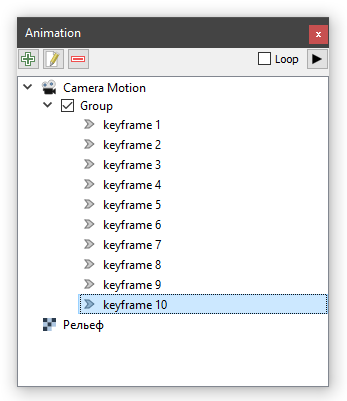
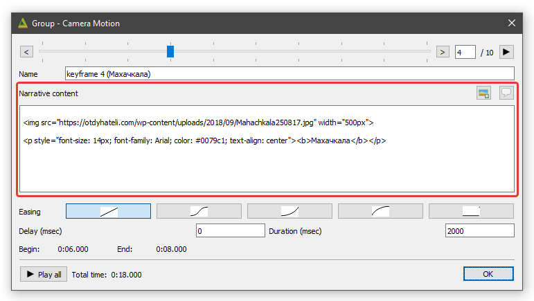
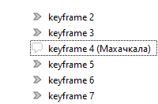
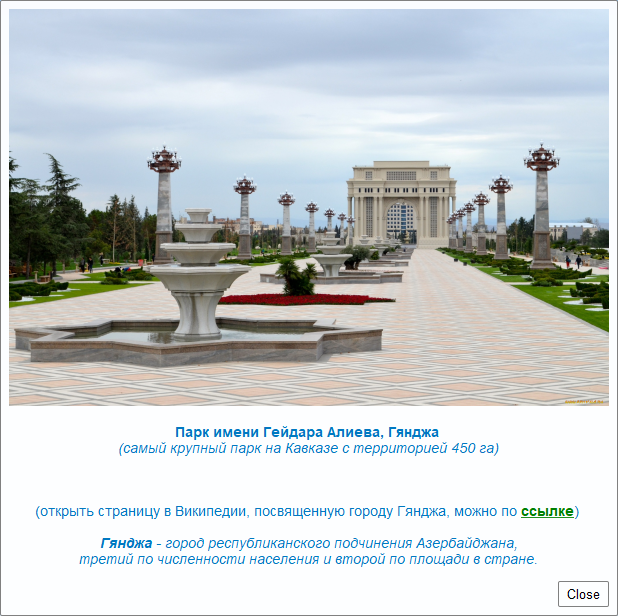
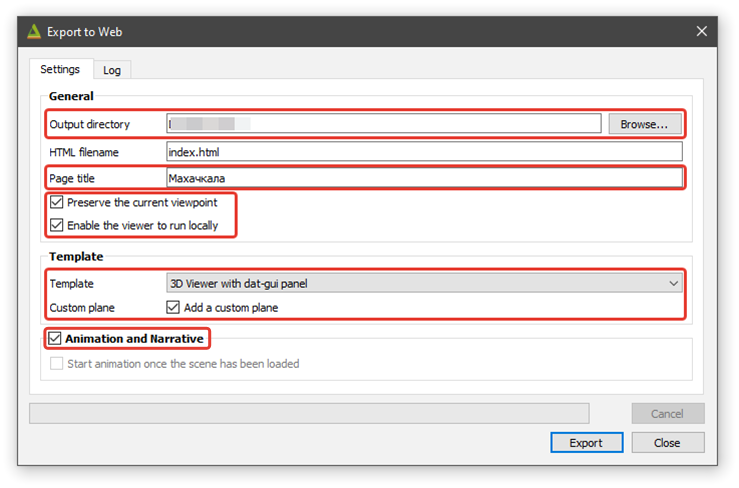
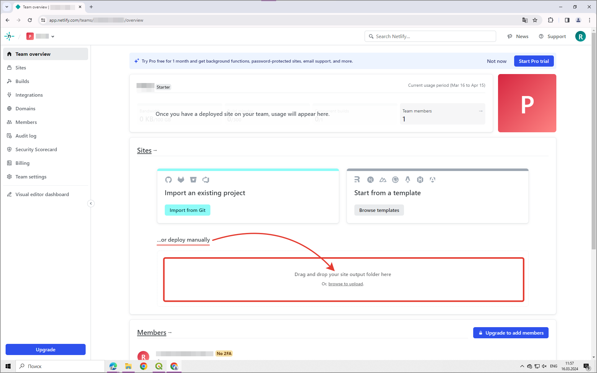

<!-- ВАЖНО: без "layout: default" локально не работает - сайт генерится, но без макета -->
<!-- А на GitHub, если есть любой пункт в заголовке, то сразу стр. 404. Нормально рендерится только когда вообще нет заголовка -->
<!-- Встречал еще какой-то tagline: Easy websites with GitHub Pages -->

<!-- 
    С проблемностью title/description при разворачивании на GitHub нашел пока такой выход:
    Если самая первая строка в README.md «простой текст», а не заголовок, то title/description берутся из _config.yml
 -->

Этот сайт можно открывать по короткой ссылке **bit.ly/RUDN-QGIS-3D-L1**. \
*Регистр букв должен быть сохранен, то есть заглавные буквы должны быть заглавными.*
  

 <!-- двойная разделительная линия ======================================================== -->
 

<!-- TOC -->

### ОГЛАВЛЕНИЕ

- [Введение](#введение)
- [Получение и подготовка исходных данных](#получение-и-подготовка-исходных-данных)
	- [Установка геоинформационной системы QGIS](#установка-геоинформационной-системы-qgis)
	- [Загрузка заготовки QGIS-проекта](#загрузка-заготовки-qgis-проекта)
	- [Выбор варианта работы](#выбор-варианта-работы)
	- [Загрузка цифровой модели рельефа](#загрузка-цифровой-модели-рельефа)
	- [Дополнительные сервисы космоснимков](#дополнительные-сервисы-космоснимков)
- [Подготовка геоинформационных слоев QGIS-проекта](#подготовка-геоинформационных-слоев-qgis-проекта)
- [Создание базовой 3D-модели в модуле Qgis2threejs](#создание-базовой-3d-модели-в-модуле-qgis2threejs)
	- [Установка в QGIS модуля Qgis2threejs](#установка-в-qgis-модуля-qgis2threejs)
	- [Настройка основных параметров и свойств 3D-сцены](#настройка-основных-параметров-и-свойств-3d-сцены)
	- [Добавление к 3D-модели текстурирующих ЦМР изображений](#добавление-к-3d-модели-текстурирующих-цмр-изображений)
- [Добавление дополнительных элементов оформления](#добавление-дополнительных-элементов-оформления)
- [Окончательные настройки 3D-модели перед экспортом в html](#окончательные-настройки-3d-модели-перед-экспортом-в-html)
- [Создание анимации пролета над поверхностью 3D-модели](#создание-анимации-пролета-над-поверхностью-3d-модели)
	- [Формирование маршрута пролета по ключевым кадрам](#формирование-маршрута-пролета-по-ключевым-кадрам)
	- [Наполнение стоп-кадра повествовательным содержанием](#наполнение-стоп-кадра-повествовательным-содержанием)
- [Экспорт 3D-модели в html-веб-страницу 3D-геопортала](#экспорт-3d-модели-в-html-веб-страницу-3d-геопортала)
- [Публикация html-страницы с 3D-моделью в интернет](#публикация-html-страницы-с-3d-моделью-в-интернет)
- [Экспорт 3D-модели в обменный файл формата glTF](#экспорт-3d-модели-в-обменный-файл-формата-gltf)
- [Обязательный самоконтроль результатов проделанной работы](#обязательный-самоконтроль-результатов-проделанной-работы)
 

<!-- /TOC -->

 
## Введение

Данная практическая работа посвящена созданию 3D&#8209;модели местности по реальному рельефу с&nbsp;текстурированием его космическими снимками высокого разрешения и картографическими изображениями. 
Работа выполняется в открытой геоинформационной системе (ГИС) 
   <a href="https://qgis.org" 
      title="Ссылка на сайт проекта QGIS" 
      target="_blank">
      <b>QGIS</b></a>. \
В результате работы вами будет осуществлен экспорт итоговой 3D&#8209;модели в обменный 3D&#8209;формат, 
а&nbsp;также создан и опубликован в интернет соответствующий **3D&#8209;геопортал**.

В качестве образца того, что у вас должно получиться в результате выполнения работы, 
рекомендуется ориентироваться на подготовленный преподавателем, как пример, \
«**3D-геопортал окрестностей города Гянджа (Азербайджан)**»:

   <a href="https://3d-ganja-azerbaijan.netlify.app"
      target="_blank">
      
   <a>

*Щелкните по рисунку выше левой клавишей мыши. Веб-страница с подготовленным примером (образцом) 3D&#8209;геопортала откроется в новой вкладке.* \
В этом образце присутствуют все элементы, которые обязательно должны быть представлены и в&nbsp;вашем итоговом&nbsp;результате.

 

 <!-- двойная разделительная линия ======================================================== -->
 
## Получение и подготовка исходных данных

Создайте на своем компьютере в корне диска «C:» (или диска «D:», если имеется) рабочую папку с названием, например, «**Work_Dir_3D**» 
и все скачиваемые и создаваемые вами файлы помещайте **только в эту папку**. 
Не "разбрасывайте" файлы и папки с данными по всему компьютеру. \
Весьма удобным и практичным вариантом при выполнении данной работы, является размещение вашей рабочей папки на съемном USB&#8209;флеш&#8209;накопителе (флешке).

> #### ***Внимание !!!***  
> *Некоторые алгоритмы, которые будут задействованы в ходе данной лабораторной работы, с "русскими" папками НЕ работают.*
> *Поэтому имена всех ваших файлов и папок (как и пути к ним) не должны содержать русских букв и специальных символов (кроме допускающегося нижнего подчеркивания «_»&nbsp;).*
> *Нигде не должно быть <u>пробелов</u>, точек, запятых и т.п.*
> *Везде должны быть только английские буквы и/или цифры.*
<!-- 
ОБЯЗАТЕЛЬНО проверьте, под какой учетной записью вы работаете на компьютере (ее имя). \
***Как проверить:*** *если у вас ОС Windows, то зайдите в папку «C:/Users/» («C:/Пользователи/») и посмотрите нет ли в ней папок (профилей пользователя) с названиями на русском языке.* \
Если ее название (имя) на русском языке (например, "Евгений", "Мария" и т.п.), то функция «Export&nbsp;to&nbsp;Web» (создание html&#8209;веб&#8209;страницы с вашей 3D&#8209;моделью) работать не будет. \
В этом случае, **СОЗДАЙТЕ на вашем компьютере новую (дополнительную) учетную запись на английском языке и работайте под ней**.
Или работайте под своей обычной учетной записью, а&nbsp;«Export&nbsp;to&nbsp;Web» выполните из&#8209;под новой учетной записью (с именем на английском). \
С какими-либо другими действиями проблем возникать не должно.
 -->

 
### Установка геоинформационной системы QGIS

Для выполнения данной работы вам потребуется скачать и установить на свои компьютеры геоинформационную систему 
   <a href="https://qgis.org" 
      title="Ссылка на сайт проекта QGIS" 
      target="_blank">
      <b>QGIS</b></a>.
Это свободно распространяемое программное обеспечение, для его установки и использования не требуется покупка или регистрация. \
QGIS является проектом 
   <a href="https://www.osgeo.org" 
      title="Ссылка на сайт OSGeo" 
      target="_blank">
      Open Source Geospatial Foundation</a>
(OSGeo). 
QGIS работает на Windows, Mac&nbsp;OSX, Linux, Unix и Android, поддерживает множество векторных и растровых форматов, баз&nbsp;данных и обладает широчайшими функциональными возможностями.

> Скачать установщик QGIS для ОС **Windows** (версии 3.16.16) можно по прямой 
   <a href="https://download.qgis.org/downloads/QGIS-OSGeo4W-3.16.16-1-Setup-x86_64.exe" 
      title="Ссылка для загрузки установщика QGIS для Windows">
      <!-- target="_blank" я ЗАКОММЕНТИЛ - без него не происходит лишнего "взмигивания страницы". ">" пришлось перенести в строку выше -->
      <b>ссылке</b></a>.
> 
> Установщик QGIS для ОС **macOS** скачивается с сайта проекта QGIS по 
   <a href="https://qgis.org/ru/site/forusers/download.html" 
      title="Ссылка для загрузки установщика QGIS для macOS"
      target="_blank">
      <b>ссылке</b></a> \
> *(устанавливайте наиболее стабильную LTR версию)*.

 
⚠️ При установке QGIS не изменяйте предлагаемые мастером установки параметры. В том числе: 
&nbsp;&nbsp;&nbsp;&nbsp;&nbsp;&nbsp;&nbsp;&nbsp;&nbsp; ☑&nbsp; папку для установки программы QGIS оставьте предлагаемой по умолчанию, \
&nbsp;&nbsp;&nbsp;&nbsp;&nbsp;&nbsp;&nbsp;&nbsp;&nbsp; ☒&nbsp; не устанавливайте предлагаемые наборы данных (в них нет необходимости).

Запустите геоинформационную систему QGIS, чтобы убедиться в ее работоспособности. \
Для этого в ОС Windows нажмите кнопку «**Пуск**», перейдите к группе «**QGIS&nbsp;3.16**» и выберите программу «**QGIS&nbsp;Desktop&nbsp;3.16.16&nbsp;with&nbsp;GRASS&nbsp;7.8.5**».

 
### Загрузка заготовки QGIS-проекта

Скачаете файл «**Заготовка Проекта 3D _ 2025-06-16.qgs**» с необходимой для работы заготовкой QGIS-проекта по 
   <a href="./materials/Заготовка Проекта 3D _ 2025-06-16.qgs" 
      title="Ссылка для загрузки заготовки QGIS-проекта" >
      <!-- target="_blank" я ЗАКОММЕНТИЛ - без него не происходит лишнего "взмигивания страницы". ">" пришлось перенести в строку выше -->
      <b>ссылке</b></a>, 
переместите его в вашу рабочую папку и переименуйте *(в данном случае русские буквы допустимы)* по шаблону **`QGIS-проект_3D-L1_<ваша группа>_<ваша фамилия>`**.

Откройте заготовку проекта в&nbsp;геоинформационной системе QGIS, перетянув ее файл на основное окно (окно Карты) программы QGIS. 
Окно QGIS должно принять вид, аналогичный показанному на рисунке ниже:

Для удобства работы (в данном конкретном случае) рекомендуется закрыть расположенную в интерфейсе программы QGIS слева панель «**Обозреватель**».

Как вы можете видеть на панели «**Слои**», расположенной в левой части интерфейса, в заготовку QGIS&#8209;проекта уже включены 9 (девять) геоинформационных слоев (ГИС&#8209;слоев), 
загружаемых с&nbsp;внешних веб&#8209;ресурсов и, соответственно, требующих устойчивого подключения к интернет:

1. «**Сетка тайлов ЦМР**» *— схема "нарезки" глобальных цифровых моделей рельефа на стандартные тайлы (размером 1&deg; х 1&deg;) с указанием их идентификаторов (номенклатур); \
используется для выбора тайлов, необходимых для покрытия нужной территории.*
2. «**Горизонтали из VT MapTiler**» *— слой векторных тайлов горизонталей (contour&nbsp;lines) \
(в данной части работы слой, обычно, не используется).*
3. «**Hydrography overlay layer by EOX**» *— растровый тайловый слой&#8209;сервис гидрографии (слой глобального покрытия земной поверхности внутренними водными объектами).*
4. «**Космоснимки Google**» *— растровый тайловый слой-сервис глобального покрытия земной поверхности данными космической съемки (в том числе сверхвысокого разрешения) от корпорации Google&nbsp;LLC.*
5. «**Карта OSM Standard**» *— растровая тайловая базовая карта на основе данных проекта OpenStreetMap в его стандартном стиле.*
6. «**VT-ESRI OSM provider - OpenStreetMap_v2**» *— векторная тайловая базовая карта на основе данных проекта OpenStreetMap в его стандартном стиле от компании&nbsp;ESRI.*
7. «**Карта OpenTopoMap**» *— растровая тайловая базовая карта на основе данных проекта OpenStreetMap в топографическом стиле.*
8. «**Карта рельефа из Maps-For-Free**» *— растровая тайловая цветовая карта рельефа со светотеневой отмывкой (в сине&#8209;голубой цветовой гамме предстаавлены только внешние водные объекты: океаны и моря).*
9. «**Слой зданий с высотами в метрах**» *— слой векторных тайлов контуров зданий с указанием их высот в метрах (в данной части работы слой, обычно, не используется).*

 
### Выбор варианта работы

В качестве варианта для данной работы вы можете самостоятельно выбрать один стандартный тайл глобальной цифровой модели рельефа (ЦМР) на любую интересную вам территорию, но при этом обязательно с эффектным 
и достаточно пересеченным  рельефом местности.

Приблизьтесь на Карте к интесующей вас территории и включите видимость слоя «**Карта&nbsp;OpenTopoMap**», поставив галочку в чек&#8209;боксе слева от его имени в панели «Слои». \
Видимость же слоя «VT-ESRI OSM provider - OpenStreetMap_v2» отключите. \
Помимо прочей топографической информации, в слое «Карта&nbsp;OpenTopoMap» на мелких масштабах рельеф местности отображается способом гипсометрической окраски с отмывкой, 
а на крупных масштабах — к отмывке рельефа добавляются горизонтали (contour&nbsp;lines). 

Включите в QGIS видимость слоя «**Сетка тайлов ЦМР**» с границами "нарезки" глобальных цифровых моделей рельефа на стандартные тайлы. \
При достаточном приближении (укрупнении масштаба Карты) для каждого тайла отобразится его идентификатор (номенклатура). 

С помощью слоев «Карта&nbsp;OpenTopoMap» и «Сетка&nbsp;тайлов&nbsp;ЦМР» вы сможете легко подобрать и идентифицировать тайл, 
в пределах границ которого создаваемая вами 3D&#8209;модель территории будет выглядеть наиболее впечатляюще. \
Слои «Карта&nbsp;рельефа&nbsp;из&nbsp;Maps&#8209;For&#8209;Free» и «Hydrography&nbsp;overlay&nbsp;layer&nbsp;by&nbsp;EOX», имеющиеся в заготовке QGIS&#8209;проекта, также будут при этом весьма полезны. \
*При этом важно понимать, что тайлом ЦМР покрывается достаточно обширная территория: длина вертикальной (вдоль мередиана) стороны стандартного тайла составляет (на&nbsp;эллипсоиде) примерно 111&nbsp;км.*

>#### Сообщите идентификатор (номенклатуру) самостоятельно выбранного вами для работы тайла личным сообщением преподавателю в&nbsp;**MS&nbsp;Teams** или в **Яндекс Мессенджер**.

 
При отсутствии желания подбирать для создания 3D&#8209;модели собственный район (тайл), вы можете взять для выполнения данной работы "стандартный" вариант тайла 
цифровой модели рельефа в&nbsp;соответствии со своим порядковым номером в списке вашей учебной группы. \
В этом случае перейдите на [страницу выбора "стандартного" варианта работы (тайла)](./materials/variants_of_work.html).

 
### Загрузка цифровой модели рельефа

Где найти и каким образом загрузить необходимую для работы **цифровую модель рельефа**, прочитайте на отдельной [странице с подробной инструкцией](./materials/how_to_download_dem.html).

 
### Дополнительные сервисы космоснимков

Скачайте по 
   <a href="./materials/Дополнительные сервисы космоснимков.qlr" 
      title="Ссылка для загрузки файла «Дополнительные сервисы космоснимков.qlr»" >
      <!-- target="_blank" я ЗАКОММЕНТИЛ - без него не происходит лишнего "взмигивания страницы". ">" пришлось перенести в строку выше -->
      <b>ссылке</b></a>
файл «**Дополнительные сервисы космоснимков.qlr**» (файл описания слоя, QGIS Layer Definition File) и переместите его в вашу рабочую папку.

Если в ходе выполнения работы вы обнаружите, что «Космоснимки Google» (они уже имеются в слоях исходной заготовки QGIS&#8209;проекта) на вашу территорию 
будут выглядеть не очень качественно (не выровненные по яркости и цвету мозаики снимков, облачность и т.п.), то обязательно попробуйте использовать другие веб&#8209;сервисы с космоснимками. \
Для этого перетяните на Карту вашего QGIS&#8209;проекта скаченный файл «Дополнительные сервисы космоснимков.qlr».
В результате в панель «Слои» добавится новая группа с названием «**Дополнительные космоснимки**», содержащая три слоя:
- «Космоснимки Mapbox»
- «Космоснимки ESRI»
- «Космоснимки Bing»

Используйте для текстурирования рельефа тот слой, который дает наилучший итоговый результат.

 

 <!-- двойная разделительная линия ======================================================== -->
 

## Подготовка геоинформационных слоев QGIS-проекта

<!-- 
Чтобы слой «Сетка тайлов ЦМР» не мешал вам при дальнейшей работе, **удалите его** из QGIS&#8209;проекта. 
Для этого в панели «Слои» щелкните правой клавишей мыши по имени слоя и в&nbsp;открывшемся контекстном меню выберите пункт «**Удалить&nbsp;слой...**». 
Или же, выделив слой щелчком левой клавишей мыши по его имени, нажмите комбинацию клавиш «**Ctrl&nbsp;+&nbsp;D**». \
Кроме того, выделив слой, можно просто нажать кнопку  *(самая правая в панели «Слои»)*.
 -->

Добавьте в QGIS-проект **цифровую модель рельефа** вашего района (тайла), как новый ГИС-слой. \
Для этого перетяните на основное окно программы QGIS (на окно Карты) файл вашей ЦМР *(например, файл «N37E027.hgt», 
скаченный вами ранее с сайта «30&#8209;Meter&nbsp;SRTM&nbsp;Tile&nbsp;Downloader»)*.

Центрируйте ЦМР в окне Карты. 
Для этого в панели «Слои» щелкните правой клавишей мыши по названию слоя вашей ЦМР, а&nbsp;в&nbsp;открывшемся контекстном меню выберите «**Увеличить&nbsp;до&nbsp;слоя**».

Перетаскивая слои в панели «Слои» по вертикали, расположите их в следующем порядке:

 
Выделите в панели «Слои» ГИС-слой ЦМР, щелкнув по его названию левой клавишей мыши.

Откройте панель «**Стили**», нажав кнопку  *(самая левая в панели «Слои»)*.

Измените способ отображения ГИС-слоя ЦМР с «Одноканальное серое» на «Одноканальное псевдоцветное».

Настройте цветовое представление ЦМР таким образом, чтобы отображение рельефа местности вашего района в целом выглядело эффектно и визуально привлекательно, 
а имеющиеся на нем формы рельефа интерпретировались наиболее наглядно.

Для этого воспользуйтесь следующими возможностями и опциями настройки отображения одноканальных растровых слоев, имеющимися в панели «Стили»:

   * Установите для представления рельефа красивый цветовой градиент, воспользовавшись опцией «Цветовой ряд» и имеющимися в ней дополнительными настройками.
		> #### ***Рекомендация:*** 
		> <i>В QGIS имеется богатейшая коллекция готовых цветовых градиентов.  
		> Щелкните правой клавишей мыши по центру самого цветового градиента, представленного в опции «Цветовой ряд».  
		> Выберите «Новый цветовой ряд». Далее — тип цветового ряда «Каталог:&nbsp;cpt&#8209;city».  
		> В открывшемся окне в разделе «Topography» выберите, например, как весьма неплохой вариант для отображения рельефа, палитру «**wiki&#8209;knutux**».</i>

   * Измените опцию «Режим» со значения «Непрерывный» на «Равные интервалы» или на «Квантили» и подберите подходящее значение для соответствующей опции «Классы».

   * Более «тонкой» настройки стиля цветового представления ЦМР *(например, чтобы высота, соответствующая поверхности моря, показывалась голубым или синим)* можно добиться, 
изменяя опции «Значение» и «Цвет» для каждого отдельного класса.

 
На протяжении выполнения всей работы, после внесения каких-либо изменений в ваш QGIS&#8209;проект, **обязательно сохраняйте его** во избежание случайной потери полученных вами результатов. \
Еще правильнее и надежнее, если дополнительно вы будете регулярно сохранять отдельную резервную копию файла вашего актуального QGIS&#8209;проекта.

 

 <!-- двойная разделительная линия ======================================================== -->
 

## Создание базовой 3D-модели в модуле Qgis2threejs

Для дальнейшей работы вам потребуется дополнительный специальный модуль **Qgis2threejs**. \
Это мощный инструмент для создания в QGIS интерактивных трехмерных визуализаций (3D&#8209;моделей) на основе растровых и векторных пространственных данных — в&nbsp;первую очередь, цифровых моделей рельефа, 
для их отображения в&nbsp;веб&#8209;браузерах и публикации в интернет. 
> <i> Для просмотра результатов вам понадобится современный веб&#8209;браузер, поддерживающий технологию WebGL — стандарт для рендеринга 3D-графики в&nbsp;браузере без необходимости в дополнительных плагинах.  
> Посетите страницу 
>   <a href="https://get.webgl.org" 
>      title="Ссылка на сайт get.webgl.org" 
>      target="_blank">
>      https://get.webgl.org</a>, 
> чтобы проверить, поддерживает ли ваш&nbsp;веб&#8209;браузер WebGL.</i>

Кроме того, модуль позволяет сохранить 3D&#8209;модели в формате glTF для <abbr title="3D computer graphics">3DCG</abbr> или 3D&#8209;печати.

Подробная **онлайн-документация** для модуля Qgis2threejs *(на английском)* доступна по 
   <a href="https://minorua.github.io/Qgis2threejs/docs" 
      title="Ссылка на онлайн-документацию для модуля Qgis2threejs" 
      target="_blank">
      <b>ссылке</b></a>.

### Установка в QGIS модуля Qgis2threejs

Модуль Qgis2threejs не включается в базовую поставку QGIS и его нужно установить отдельно. \
Для установки модуля откройте в QGIS меню «**Модули&nbsp;&rArr;&nbsp;Управление&nbsp;модулями...**» и дождитесь, пока сведения о модулях загрузятся.

В открывшемся окне управления модулями перейдите на вкладку «**Все**» и введите `Qgis2` в строке поиска. Модули будут отфильтрованы по названию.

Выберите модуль Qgis2threejs в списке и нажмите кнопку «**Установить модуль**» внизу окна. 

Дождитесь, пока модуль загрузится и установится.

После установки, доступ к модулю можно получить через меню QGIS «**Интернет&nbsp;&rArr;&nbsp;Qgis2threejs**».
Одновременно в панели инструментов появится иконка . Нажмите на нее, чтобы запустить модуль Qgis2threejs.

### Настройка основных параметров и свойств 3D-сцены

В открывшемся окне «**Qgis2threejs Exporter**» включите (активируйте) слой вашей цифровой модели рельефа *(в моем примере это «n37_e027_1arc_v3»)*, 
поставив галочку в соответствующем чек-боксе напротив имени слоя ЦМР. \
Высоты из этого слоя будут использоваться для создания 3D&#8209;поверхности, а текстурирующее ее изображение (материал) будет соответствовать текущему изображению в основном окне карты.

 
Если поверхность «Flat Plane» («Плоская Плоскость») окажется включена, то обязательно отключите ее, сняв галочку в соответствующем чек-боксе. \
 
> #### ***Очень важная информация:***
> *Обратите особое внимание, что настройки, сделанные вами в модуле Qgis2threejs, сохраняются в отдельный файл с расширением **\*.qto3settings** и с именем,* 
> *как и у файла самого QGIS&#8209;проекта и рядом с ним (в том же месте, где расположен и файл QGIS&#8209;проекта).
> При этом сохранение осуществленных настроек 3D&#8209;экспорта в этот файл происходит **в момент закрытия** окна модуля Qgis2threejs. \
> Когда вы откроете модуль Qgis2threejs повторно, все сохраненные для него в файле с расширением *\.qto3settings настройки 3D&#8209;экспорта будут восстановлены. \
> Поэтому, внося изменения в настройки 3D&#8209;экспорта, обязательно регулярно закрывайте модуль Qgis2threejs, сохраняя таким образом 
> результаты проделанной вами работы во избежание их возможной потери (в том числе и при аварийном завершении работы программы QGIS). \
> Еще правильнее и надежнее — дополнительно сохранять **отдельную резервную копию** актуального файла \*.qto3settings ваших настроек 3D&#8209;экспорта.*

 
Перейдите в «Qgis2threejs Exporter» к меню «**Scene&nbsp;&rArr;&nbsp;Scene&nbsp;Settings...**» и в появившемся окне задайте (введите) следующие опции:  

Увеличьте значение опции «**Z&nbsp;exaggeration**» (коэффициента вертикального масштабирования) с&nbsp;«**1.0**» до «**1.8**», сделав рельеф местности более выраженным (подчеркнутым). \
Однако, для некоторых территорий (например, молодые горы с большой крутизной склонов), рельеф, при таком коэффициенте увеличения по вертикали, может выглядеть не так естественно. \
В таких случаях, чтобы получить более корректный результат, следует несколько уменьшить значение опции «Z&nbsp;exaggeration».

Измените значение опции «**Coordinate Display**» на «Latitude and longitude» — это позволит, при определении координат интересующих точек и объектов на 3D&#8209;модели в браузере, 
получать их значения в привычном для большинства пользователей представлении: в географической системе координат (в географических градусах/минутах/секундах).

В блоке «**Base Extent**» выберите опцию/метод «**Fixed&nbsp;extent**», нажмите кнопку «**Select…**» и выберите в появившемся списке вариант «**Use&nbsp;Layer&nbsp;Extent…**» (использовать охват слоя). \
В появившемся окошке выберите из ниспадающего меню название слоя вашей ЦМР *(в моем примере это «n37_e027_1arc_v3»)*: \

Проверьте опцию «**Fix aspect ratio to 1:1**». Если она окажется включена, то отключите ее.

Округлите значения параметров в ячейках «**Width**» и «**Height**» *(они задают размер 3D&#8209;модели по горизонтальным осям **<u>в метрах</u>**)* до **1000** (тысяч метров) **в сторону уменьшения**.

Задав в панели «Scene Settings» необходимые опции и их значения, нажмите сначала кнопку «**Применить**» и, если результат в окне предпросмотра (Preview) вас устраивает, кнопку «**ОК**».

Откройте в «Qgis2threejs Exporter» меню «Scene» и выберите подменю/действие «**Reload**». \
В результате 3D&#8209;модель пересчитается и сцентрируется в окне предпросмотра (Preview), \
а ее границы будут совпадать с границами слоя (тайла) вашей ЦМР.

### Добавление к 3D-модели текстурирующих ЦМР изображений

В окне «Qgis2threejs Exporter» в панели «Layers» щелкните правой клавишей мыши по имени слоя вашей ЦМР и выберите в открывшемся контекстном меню пункт «**Properties...**».

На закладке «**Main**» появившейся панели, в блоке «**Material**», выделите текстурирующее ЦМР изображение «**map (canvas)**» и удалите его, 
нажав кнопку .

> #### ***Справочно:***
> *Изображение «map (canvas)» — это то, что отображается в основном окне карты QGIS в данный момент. 
> При грамотном обращении им очень полезно пользоваться: меняя порядок ГИС-слоев и переключая их видимость, 
> можно легко сформировать необходимое комбинированное текстурирующее ЦМР изображение.*

 
Последовательно добавьте для вашей 3D&#8209;модели три текстурирующих ЦМР изображения. \
Для этого в блоке «Material» нажмите кнопку  и выберите в появившемся списке вариант «**Select&nbsp;Layer(s)…**». 
В открывшемся меню поставьте галочку в чек-боксе напротив имени слоя «Космоснимки Google» и нажмите кнопку «**OK**».

Аналогичным образом добавьте для 3D&#8209;модели еще два текстурирующих ЦМР изображения: слой «Карта OpenTopoMap» и слой вашей ЦМР с настроенным вами ранее ее цветовым представлением.

В блоке «Material» измените название слоя ЦМР на «Цветной рельеф». \
*Для переименования сделайте двойной клик левой клавишей мыши по названию слоя ЦМР.*

Нажмите внизу панели «Layer Properties» кнопку «**Применить**». \
*Кнопку «**ОК**» не нажимайте — оставьте панель открытой.*

 
Перейдите в панели «Layer Properties» на закладку «**Others**» и задайте следующие опции:

Опция «**Altitude of bottom**» определяет положение по вертикали основания (днища) формируемой 3D&#8209;модели (в метрах) и, соответственно, высоту ее боковых сторон *(в&nbsp;моем примере это «-2000»)*.
  

> #### ***Справочно:***
> *По умолчанию это значение равно «**0**», что соответствует уровню мирового океана (правильнее — поверхности общемирового эллипсоида WGS-84), и, во многих случаях, оно **не будет оптимальным**. 
> Очень часто возникает необходимость изменить высоту боковых сторон 3D&#8209;модели с тем, чтобы модель выглядела изящнее (эстетичнее). \
> Это легко сделать, изменив значение параметра «Altitude&nbsp;of&nbsp;bottom» на более подходящее. При этом значения могут быть как положительными 
> (тогда основание модели смещается над поверхностью мирового океана вверх), так и отрицательными (в этом случае основание модели опускается ниже уровня мирового океана).*

 
Задав на закладке «Others» необходимые опции, нажмите внизу панели кнопку «**Применить**». \
Вращая 3D&#8209;модель, убедитесь, что высота всех ее боковых сторон вас устраивает, после чего нажмите&nbsp;кнопку «**ОК**».

> *Если вы обнаружите, что на некоторых боковых сторонах 3D&#8209;модели присутствуют артефакты (нежелательные эффекты) "вертикального смазывания" крайних пикселей текстурирующих ЦМР изображений 
> (артефакты показаны ниже на рисунке слева),* 
> 
> *то это будет означать, что вы **<u>не выполнили</u>** описанное выше необходимое округление значений параметров «Width» и «Height» в панели «Scene Settings». \
> Исправьте эту недоработку обязательно.*

 

 <!-- двойная разделительная линия ======================================================== -->
 

## Добавление дополнительных элементов оформления

Включите в создаваемый вами **3D-геопортал** дополнительные элементы оформления.

А) Добавьте стрелку, указывающую направление на север. Для этого сделайте следующее:
- Перейдите в «Qgis2threejs Exporter» в меню «**View &rArr; Widgets &rArr; North&nbsp;Arrow...**».
- Поставьте галочку в чек&#8209;боксе «**Enable&nbsp;North&nbsp;Arrow**».
- Выберите **цвет** для добавляемой в 3D&#8209;геопортал стрелки&#8209;указателя направления на север.

- Нажмите кнопку «**Применить**». В нижнем левом углу окна «Qgis2threejs Exporter» появится трехмерная стрелка севера, которая будет синхронизирована с 3D&#8209;моделью местности. \
Если результат (цвет стрелки) вас устраивает, нажмите кнопку «**ОК**».

 
Б) Добавьте красиво оформленные верхний и нижний колонтитулы.

&nbsp;&nbsp;&nbsp;&nbsp; ☑&nbsp; Верхний колонтитул должен содержать логотип РУДН и информацию о географическом \
&nbsp;&nbsp;&nbsp;&nbsp;&nbsp;&nbsp;&nbsp;&nbsp;&nbsp; расположении (или названии) территории вашей 3D-модели и стране ее локации.

&nbsp;&nbsp;&nbsp;&nbsp; ☑&nbsp; Нижний колонтитул — вашу **Фамилию Имя Отчество** и взятый в скобки код вашей группы.

 
Для добавления колонтитулов перейдите в меню «**View &rArr; Widgets &rArr; Header/Footer&nbsp;Labels...**».
 
> #### ***Обязательно:***
> *Сделать красивое оформление текста колонтитулов геопортала можно с помощью HTML&#8209;синтаксиса, используя имеющиеся шаблоны (html&#8209;заготовки):* \
> \
> *1) Откройте шаблон верхнего колонтитула в txt-представлении по 
>   <a href="./materials/Колонтитул верхний (Header Label) - 2023-11-21.txt" 
>      title="Ссылка на txt-файл «Колонтитул верхний (Header Label)»" 
>      target="_blank">
>      <b>ссылке</b></a>. \
> Выделите весь текст, нажав комбинацию клавиш «**Ctrl&nbsp;+&nbsp;A**» на клавиатуре [<b>*</b> ]. \
> Скопируйте его в буффер обмена и вставьте в верхний колонтитул (Header&nbsp;Label). \
> Измените текст «**окрестностей Махачкалы**» на географическое расположение или название территории вашей 3D&#8209;модели. \
> \
> 2) Откройте шаблон нижнего колонтитула в txt-представлении по 
>   <a href="./materials/Колонтитул нижний (Footer Label)   - 2023-11-21.txt" 
>      title="Ссылка на txt-файл «Колонтитул нижний (Footer Label)»" 
>      target="_blank">
>      <b>ссылке</b></a>. \
> Выделите весь текст, нажав комбинацию клавиш «**Ctrl&nbsp;+&nbsp;A**» на клавиатуре [<b>*</b> ]. \
> Скопируйте его в буффер обмена и вставьте в нижний колонтитул (Footer&nbsp;Label). \
> Конечно, отредактируйте текст, корректно указав ваши ФИО и код вашей группы. \
> \
> 3) Добавьте в верхний колонтитул **логотип&nbsp;РУДН**. \
> Для этого откройте SVG-логотип РУДН в txt-представлении по 
>   <a href="./materials/Логотип РУДН в SVG - 2023-11-21.txt" 
>      title="Ссылка на txt-файл «Логотип РУДН в SVG»" 
>      target="_blank">
>      <b>ссылке</b></a>. \
> Выделите весь текст, нажав комбинацию клавиш «**Ctrl&nbsp;+&nbsp;A**» на клавиатуре [<b>*</b> ]. \
> Скопируйте его в буффер обмена и замените им **всю** имеющуюся в верхнем колонтитуле строку:* \
> **`<!-- ВСТАВЬТЕ ВМЕСТО ЭТОЙ СТРОКИ ВЕСЬ ТЕКСТ ИЗ ФАЙЛА "SVG-логотип РУДН.txt" -->`***, \
включая входящие в нее угловые скобки* **<** *и* **>**. 
> 
> 
> <i>[&#9733;] - следите за тем, чтобы при открытии текстового шаблона в вашем браузере, отображался именно оригинальный его текст, а не результат автоперевода.  
> Автоматический перевод изменит изначальное корректное написание html&#8209;тегов и форматирование создаваемых вами колонтитулов нарушится.
</i>

 
Нажмите кнопку «**Применить**». Если результат вас устраивает, нажмите кнопку «**ОК**».

 

 <!-- двойная разделительная линия ======================================================== -->
 

## Окончательные настройки 3D-модели перед экспортом в html

Еще раз откройте панель «**Layer Properties**» в которой задаются многие важные свойства как самой ЦМР, так и текстурирующих ее изображений (слоев). \
Для этого в «Qgis2threejs Exporter» щелкните правой клавишей мыши по названию слоя вашей ЦМР (теперь, после переименования, оно должно быть «Рельеф») 
и выберите в открывшемся контекстном меню пункт «**Properties...**». \
*Или можно просто сделать двойной клик левой клавишей мыши по слову «Рельеф».*

В открывшейся панели в блоке «**Geometry**» установите для параметра «**Resampling&nbsp;level**» *(определяет детальность рельефа итоговой 3D&#8209;модели)* 
значение «**6**», переместив движок слайдера в крайнее правое положение.

В блоке «**Material**» выделите текстурирующее ЦМР изображение «Космоснимки&nbsp;Google» и задайте (увеличьте) его детальность (разрешение). 
Для этого установите для расположенной ниже опции «**Image&nbsp;width&nbsp;(px)**» значение «**4096**», выбрав его из раскрывающегося списка.

Аналогичным образом установите значение опции «Image&nbsp;width&nbsp;(px)» для текстурирующего изображения (слоя) «Карта&nbsp;OpenTopoMap» на «**2048**», а для «Цветной&nbsp;рельеф» — на «**4096**».

Задав необходимые значения указанных опции, нажмите кнопку «**ОК**» внизу панели.

> #### ***Важная рекомендация:***
> *Слой «Карта&nbsp;OpenTopoMap» имеет эффектный топографический стиль, превосходно и наглядно передающий отображаемую местность и ее особенности. \
> Однако, иногда этот слой может загружаться крайне медлено, существенно затрудняя выполнение всей работы. \
> В таком случае, в качестве текстурирующего ЦМР картографического изображения, используйте <u>вместо</u> слоя «Карта&nbsp;OpenTopoMap» 
> слой «Карта&nbsp;OSM&nbsp;Standard».*

 
В окне «Qgis2threejs Exporter» щелкните левой клавишей мыши по названию текстурирующего изображения (слоя) «**Космоснимки&nbsp;Google**», 
после чего 3D&#8209;модель в окне «Preview» будет текстурирована слоем «Космоснимки Google». Для 3D&#8209;модели слой «Космоснимки&nbsp;Google» станет "основным" 
и именно этим слоем (изображением) будет изначально текстурирована 3D&#8209;модель при открытии ее веб-станицы в браузере.

  

> #### ***Важная рекомендация:***
> *Если вы посчитаете целесообразным выполнить какие-либо коррекции/изменения заданных значений/опций (например, изменить значение параметра «Altitude&nbsp;of&nbsp;bottom»), \
> то для ускорения перерисовки 3D&#8209;модели в окне Qgis2threejs Exporter имеет смысл временно уменьшить значения опций, определяющих детальность формируемой модели.*
> *Для этого установите движок параметра «Resampling&nbsp;level» в положение «**1**» или «**2**», а для опций «Image&nbsp;width&nbsp;(px)» 
> выберите из списка значение «**512**» или «**1024**». \
> Когда вы определитесь со всеми прочими установками и настройками, то перед созданием/экспортом финальной 3D&#8209;модели для получения ее наилучшего качества, 
> верните значения указанных выше параметров к максимальным.*

 
Откройте в «Qgis2threejs Exporter» меню «**Scene**» и выберите подменю/действие «**Reload**». \
После этого 3D&#8209;модель пересчитается и точно сцентрируется в окне предпросмотра (Preview).

Вращая в окне «Preview» 3D&#8209;модель вокруг своей оси и приближая/отдаляя ее с помощью мыши и&nbsp;клавиатуры, найдите для нее красивый эффектный ракурс. 
Он будет определять начальное положение и ориентацию 3D&#8209;модели при открытии ее веб-станицы в браузере. \
*При этом перемещать модель по горизонтали и/или вертикали не следует (вернее, крайне нежелательно) — это приведет к нежелательным эффектам при управлении 3D&#8209;моделью в браузере 
из-за смещения ее «центра&nbsp;тяжести».* \
*Подробности о возможностях и способах управления 3D&#8209;моделью в браузере смотрите на странице с краткой инструкцией, доступной по 
   <a href="./materials/instruction_how_work_with_model_in_browser.html" 
      title="Ссылка на страницу с инструкцией «Как работать с 3D-моделью в браузере»"
      target="_blank">
      <b>ссылке</b></a>.*

 

 <!-- двойная разделительная линия ======================================================== -->
 

## Создание анимации пролета над поверхностью 3D-модели

Усовершенствуйте веб-страницу вашей 3D&#8209;модели, создав красивую и эффектную анимацию пролета над ее территорией.

### Формирование маршрута пролета по ключевым кадрам

В окне «Qgis2threejs Exporter», **не изменяя** уже выбранного вами начального ракурса 3D&#8209;модели, в&nbsp;панели «**Animation**» щелкните левой клавишей мыши по «**Camera&nbsp;Motion**» 
и нажмите кнопку . В&nbsp;результате создастся группа с названием «Group», которая будет объединять ключевые кадры (ракурсы) создаваемой вами анимации. 
При этом в группу сразу добавится ключевой кадр с названием «keyframe&nbsp;1», который будет фиксировать выбранный вами начальный ракурс 3D&#8209;модели в качестве стартового для вашей анимации. \

Детально продумайте маршрут и схему движения (виртуального пролета) над поверхностью вашей 3D&#8209;модели, перемещая и поворачивая 3D&#8209;модель в окне предпросмотра (Preview). \
Задействуйте при этом все имеющиеся возможности управления моделью и ее перемещения (с&nbsp;помощью мыши и клавиш со стрелками на клавиатуре в комбинации с клавишами «**Shift**» и&nbsp;«**Ctrl**»).

Последовательно перемещаясь по разработанному вами маршруту виртуального пролета, добавьте в создаваемую вами анимацию ориентировочно **от восьми до девяти** ключевых кадра *(keyframe, ракурса)*, 
нажимая кнопку  в панели «Animation».

При этом на маршруте необходимо выбрать *(желательно в середине пролета)* и задать специальный ключевой кадр (**стоп&#8209;кадр**), 
при котором внимание зрителя будет сфокусировано на&nbsp;каком-либо знаковом, 
наиболее важном для данной территории географическом объекте (населенном пункте, горной вершине, леднике, каньоне и т.п.).

Замкните маршрут вашего виртуального пролета. Для этого на панели «Animation» щелкните в группе ключевых кадров левой клавишей мыши по первому (стартовому) ключевому кадру «keyframe&nbsp;1» 
и нажмите кнопку .
Ниже «keyframe&nbsp;1» создастся новый ключевой кадр, которому будет соответствовать точно такой же ракурс, как и у первого ключевого кадра анимации. 
Перетяните вновь созданный ключевой кадр вниз, сделав его самым последним в списке. \
    

Таким образом самый первый (стартовый) и самый последний ключевые кадры анимации будут совпадать (иметь одинаковые ракурсы), 
а анимация виртуального пролета вернется в конце в&nbsp;исходное положение (в свою начальную точку).

Просмотреть получившуюся у вас анимацию, можно нажав кнопку  в панели «Animation».

Если возникнет необходимость откорректировать ракурс, соответствующий какому-либо ключевому кадру, то сделать это можно достаточно просто.
Для этого на панели «Animation» щелкните в группе ключевых кадров левой клавишей мыши по ключевому кадру, ракурс для которого необходимо скорректировать. \
Аккуратно перемещая и поворачивая 3D&#8209;модель в окне предпросмотра (Preview), установите новый (лучший) ракурс для данного ключевого кадра.
Откройте контекстное меню для этого ключевого кадра, щелкнув по его названию в группе ключевых кадров правой клавишей мыши.
В&nbsp;появившемся списке выберите подменю/действие «**Set&nbsp;current&nbsp;view&nbsp;to&nbsp;this&nbsp;keyframe...**» и подтвердите действие:

Удалить ключевые кадры, которые после просмотра анимации вы посчитаете лишними, также можно через контекстное меню соответствующего ключевого кадра.
Откройте контекстное меню ключевого кадра и выберите подменю/действие «**Remove…**».

Короткую *(38 сек.)* наглядную демонстрацию добавления ключевых кадров в анимацию, вы можете увидеть в 
   <a href="https://youtu.be/ZcU6N2D0ZaI?si=kI466dAIzbwRllFU&t=194" 
      title="Ссылка на видеоурок от Эдуарда Роккателло (Eduard Roccatello)" 
      target="_blank">
      <b>этом видеоуроке</b></a>
*(на английском)* от Эдуарда Роккателло (Eduard Roccatello), автора YouTube&#8209;канала «Tales from the GIS» *(Байки из ГИС)*.

### Наполнение стоп-кадра повествовательным содержанием

Для выбранного вами ранее **стоп&#8209;кадра**, сфокусированного на наиболее важном для данной территории географическом объекте, создайте соответствующее «Повествовательное содержание». \
Для этого на панели «Animation» сделайте двойной щелчок левой клавишей мыши по нужному ключевому кадру *(или, открыв контекстное меню ключевого кадра, перейдите к «Edit…»)*. \
В открывшейся панели в блоке «**Narrative content**» *(Повествовательное содержание)* создайте (наполните) содержимое вашего стоп&#8209;кадра в html&#8209;формате.

Для наглядности и удобства работы, находясь в показанном выше меню редактирования анимации и перейдя к опции «**Name**», вы можете переименовать стоп&#8209;кадр. 
Например, как показано на рисунке выше, `keyframe 4` переименован на `keyframe 4 (Махачкала)`. \
Также обратите внимение, что после внесения для стоп&#8209;кадра **любой** информации в блок «Narrative content», для него изменится значок в списке ключевых кадров: \

Шаблоны (html&#8209;заготовки) для создания необходимого и **обязательного** красивого оформления «Повествовательного содержания» стоп&#8209;кадров, 
размещены на странице, доступной по 
   <a href="./materials/templates_for_narrative_content.html" 
      title="Ссылка на страницу с html&#8209;заготовками">
      <!-- target="_blank" я ЗАКОММЕНТИЛ чтобы не открывалось в новой странице. ">" пришлось перенести в строку выше -->
      <b>ссылке</b></a>.

Имеющаяся в блоке «Narrative content» кнопка  позволяет добавить к вашему оформлению стоп&#8209;кадра *(в текущую позицию курсора)* изображение, 
хранящееся локально на компьютере. \
Путь к файлу изображения может представлять собой и полный URL&#8209;адрес файла изображения, размещенного в сети интернет (см. рисунок выше).
  

> #### ***Важная особенность:***
> *Если изображение размещено в интернет, и в блоке «Narrative content» вы прописываете веб&#8209;ссылку на него (полный URL&#8209;адрес его файла), то, при формировании вашей html&#8209;веб&#8209;страницы с 3D&#8209;моделью, 
> эта веб-ссылка запишется в файл «index.html». Соответственно, если ссылка на данное изображение будет изменена владельцем ресурса или изображение будет и вовсе им удалено, 
> то оно, разумеется, перестанет отображаться и в вашей html&#8209;веб&#8209;странице с 3D&#8209;моделью.* \
> *Но если вы добавляете изображение, хранящиеся на вашем компьютере* *локально, то, при формировании html&#8209;веб&#8209;страницы с 3D&#8209;моделью, 
> файл изображения будет скопирован в папку \\data\\index\\img. Таким образом изображение станет неотъемлемой частью вашей html&#8209;веб&#8209;страницы, 
> будет находиться под вашим полным контролем (в&nbsp;том числе, включая возможность его редактирования) и не исчезнет по независящим от вас причинам и обстоятельствам.* \
> *Таким образом, более надежный и правильный вариант: скачать необходимое вам изображение из интернет локально на компьютер и уже его добавлять в оформление вашего стоп&#8209;кадра, 
> воспользовавшись кнопкой  (ULR&#8209;адрес файла изображения, хранящегося локально, и начинающийся в этом случае с `file:///`, сформируется корректно — в пути будут 
> присутствовать обычные слеши&nbsp;`/`).* 

 
Увидеть и проверить, как будет выглядеть ваше оформление наполнения стоп&#8209;кадра, можно нажав соседнюю кнопку . 
При этом закрывать окно настройки анимации не требуется.

*Шаблон № 3, например, создает оформление стоп&#8209;кадра следующего вида и наполнения:*

 
**Обязательно обратите внимание на следующий важный момент:** \
Если ULR&#8209;адрес файла изображения, сохраненного на вашем компьютере, вы формируете вручную (или&nbsp;редактируете html&#8209;заготовку) и для этого скопируете путь к файлу изображения
в проводнике MS&nbsp;Windows, то в пути окажутся прописаны обратные слеши&nbsp;`\` (бекслеши). \
Обязательно **замените их** в ULR&#8209;адресе файла изображения на обычные слеши&nbsp;`/`. \
В противном случае, путь к изображению в итоговой html&#8209;веб&#8209;странице сформируется некорректно. 
И хотя при просмотре стоп&#8209;кадра в «Qgis2threejs Exporter» все будет выглядеть нормально, в самой же итоговой html&#8209;веб&#8209;странице изображение в оформлении 
«Повествовательного содержания» стоп&#8209;кадра отображаться не будет.

 

 <!-- двойная разделительная линия ======================================================== -->
 

## Экспорт 3D-модели в html-веб-страницу 3D-геопортала

Создайте внутри вашей рабочей папки «Work_Dir_3D» отдельную папку с названием «**My_3Dsite**».

Убедитесь, что в панели «Animation» в блоке «Camera Motion» в группе ключевых кадров «Group» выделен самый первый (стартовый) ключевой кадр анимации с названием «keyframe&nbsp;1», 
соответствующий выбранному вами начальному ракурсу (ориентации) 3D&#8209;модели при открытии ее&nbsp;веб-станицы в браузере. \
В противном случае, после открытия веб&#8209;станицы с вашей 3D&#8209;моделью в браузере, при запуске анимации, вместо начала ее плавного движения с исходного ракурса, 
будет происходить нежелательный резкий "перескок" ориентации 3D&#8209;модели на ракурс, соответствующий первому ключевому кадру анимации. 

Убедитесь, что расположенная в панели «Animation» опция «**Loop**» (Цикл, Петля) отключена (снята галочка в соответствующем чек-боксе). 
В противном случае, после запуска анимации, она окажется зацикленной и виртуальный пролет будет продолжаться "бесконечно" до тех пор, пока анимация не&nbsp;будет специально остановлена.

Откройте в «Qgis2threejs Exporter» меню «**File&nbsp;&rArr;&nbsp;Export&nbsp;to&nbsp;Web...**».

В появившемся окне в пункте «Output directory» укажите путь к созданной вами папке «My_3Dsite», в&nbsp;которую вы сохраните html&#8209;веб&#8209;страницу с вашей 3D&#8209;моделью, 
а также задайте следующие опции:

*Текст, вписанный вами для опции «Page Title» (в моем примере это «Махачкала»), будет отображаться как название веб-страницы (на закладке) при ее открытии в браузере.*

Не изменяйте опцию «**HTML filename**», оставив для нее значение «index.html».

Нажмите кнопку «**Export**».

После завершения процесса откроется закладка «**Log**», на которой *(если все прошло успешно)* будут перечислены выполненные модулем Qgis2threejs действия и отобразятся 
ссылки/пути к итоговым результатам:

В результате в папке «My_3Dsite» сформируется файловая структура (директории и файлы) итоговой html&#8209;веб&#8209;страницы следующего вида:

&nbsp;&nbsp;&nbsp;&nbsp;

Для открытия в браузере созданной вами html&#8209;веб&#8209;страницы с 3D&#8209;моделью достаточно сделать двойной щелчок мышью по индексному файлу «**index.html**». \
*Веб-страница с вашей 3D&#8209;моделю откроется в браузере, являющимся на вашем компьютере браузером по умолчанию.*

В меню в верхнем правом углу веб-страницы, перейдя к пункту «**Layers&nbsp;&rArr;&nbsp;Рельеф&nbsp;&rArr;&nbsp;Material**», вы сможете легко переключать текстурирующие рельеф изображения, 
выбирая из раскрывающегося списка названия необходимых слоев.

Перейдя к пункту меню «**Animation&nbsp;&rArr;&nbsp;Play**» вы сможете запустить созданную вами анимацию.

 

 <!-- двойная разделительная линия ======================================================== -->
 

## Публикация html-страницы с 3D-моделью в интернет

Зарегистрируйтесь на популярной бесплатной платформе для веб-разработки, сборки и публикации в интернет веб&#8209;сайтов **Netlify**, перейдя по ссылке 
   <a href="https://app.netlify.com" 
      title="Ссылка на сайт app.netlify.com" 
      target="_blank">
      <b>https://app.netlify.com</b></a>.

> Обязательно сохраните данные о вашей регистрации (Login и Password) в отдельный текстовый файл для последующего использования вами платформы Netlify.

 
**Загрузите на платформу Netlify созданную вами html&#8209;веб&#8209;страницу с 3D&#8209;моделью.** \
Сделать это можно простым перетягиванием *(drag-and-drop)* папки «My_3Dsite», в которую вы сохранили вашу html&#8209;веб&#8209;страницу, на&nbsp;открытую в браузере страницу сайта Netlify. 
> *Помните, что в имени этой папки должны быть только английские буквы и/или цифры.* \
> *В противном случае ваша html&#8209;веб&#8209;страница на хостинг Netlify может не загрузиться.*

> *Кроме того, при загрузке данных на хостинг Netlify (да и самой регистрации на нем) рекомендуется пользоваться браузерами **Google&nbsp;Chrome** или **Microsoft&nbsp;Edge**.* \
> *При загрузке данных на Netlify через **Яндекс&nbsp;Браузер** могут возникать сложности.*

На рисунке ниже место, куда следует перетянуть вашу папку «My_3Dsite», обведено красным прямоугольником с&nbsp;указывающей на него красной стрелкой.

 
После успешного завершения загрузки данных в браузере откроется новая страница сайта Netlify. 
В&nbsp;расположенном в левой части страницы меню выберите самый верхний раздел «**Site&nbsp;overview**». 
Вверху открывшейся страницы будет находиться кликабельная ссылка на ваш готовый сайт с&nbsp;3D&#8209;моделью (развернутый на хостинге Netlify и успешно опубликованный в интернет).

Переименуйте ваш сайт так, чтобы ссылка на него была более понятной и удобочитаемой, например, **`фамилия-территория`**. 
Для этого зайдите в раздел «**Site&nbsp;configuration**» вашего сайта, найдите кнопку «**Change&nbsp;site&nbsp;name**» и выполните необходимое переименование. \
Имейте ввиду, что старая веб&#8209;ссылка на сайт работать, разумеется, перестанет.

>#### Теперь вы можете продемонстрировать результаты своей работы кому пожелаете, просто переслав веб&#8209;ссылку на созданный и опубликованный вами сайт (3D&#8209;геопортал).

*Подробности о способах управления 3D&#8209;моделью в браузере и важных функциях созданного 3D&#8209;геопортала, смотрите на странице с краткой инструкцией, доступной по 
   <a href="./materials/instruction_how_work_with_model_in_browser.html" 
      title="Ссылка на страницу с инструкцией «Как работать с 3D-моделью в браузере»"
      target="_blank">
      <b>ссылке</b></a>.*

 
После выполнения вами ***[обязательного самоконтроля](#обязательный-самоконтроль-результатов-проделанной-работы)***, отправьте сгенерированную и 
переименованную **HTML&#8209;ссылку** на ваш сайт с 3D&#8209;моделью личным сообщением преподавателю в&nbsp;**MS&nbsp;Teams** или в **Яндекс Мессенджер** для проверки и оценки результатов вашей работы.

В случае внесения вами каких-либо изменений или исправлений в html&#8209;страницу с 3D&#8209;моделью (т.е.&nbsp;создания новой версии сайта), повторную ее публикацию в интернет 
на платформе Netlify **необходимо** выполнить **не** путем создания нового сайта, а создав новую **версию** (новую загрузку/развертывание) уже существующего сайта. \
Для этого зайдите на Netlify в раздел «**Deploys**» (Развертывание) вашего существующего сайта и загрузите папку с новой версией вашей html&#8209;страницы с 3D&#8209;моделью.
После завершения загрузки новой версии, именно она станет «Опубликованной» (Published), а ранее загруженная предыдущая версия сайта "перейдет в пассив".
Таким образом, html&#8209;ссылка, направленная ранее преподавателю и другим пользователям вашего сайта, **останется прежней**.

 

 <!-- двойная разделительная линия ======================================================== -->
 

## Экспорт 3D-модели в обменный файл формата glTF

Откройте в «Qgis2threejs Exporter» меню «**File &rArr; Save Scene As &rArr; glTF&nbsp;(.gltf,&nbsp;.glb)...**» и в появившемся окне задайте имя создаваемого gltf&#8209;файла и путь к нему.

Откройте созданный файл в онлайн glTF&#8209;вьювере (glTF Viewer), позволяющем визуализировать 3D&#8209;модели формата **gltf** и **glb** в обычном браузере. \
Для этого перейдите по ссылке
   <a href="https://gltf-viewer.donmccurdy.com"
      title="Ссылка на сайт с glTF Viewer"
      target="_blank">
      <b>https://gltf-viewer.donmccurdy.com</b></a>
и перетяните gltf&#8209;файл вашей 3D&#8209;модели в открывшееся в браузере окно онлайн glTF&#8209;вьювера. \
Обязательно поэкспериментируйте с опциями, влияющими на визуализацию модели и режимы ее освещения.

*В ОС Windows 10 и 11 у вас уже может быть предустановлено «**Средство 3D&#8209;просмотра**», открывающее 3D&#8209;объекты форматов **gltf** и **glb** по умолчанию.*
  

> #### ***Справочно:***
> ***glTF** (Graphics Library Transmission Format) — это открытый формат файлов, разработанный для&nbsp;эффективной передачи и загрузки 3D&#8209;моделей и сцен. \
> Он обеспечивает стандартизированную структуру для описания геометрии, материалов, текстур, анимации и других соответствующих данных. \
> Формат хорошо сжимает трехмерные сцены и легко взаимодействует с современными веб&#8209;технологиями, минимизируя обработку во время выполнения приложений, использующих WebGL и другие API.
> Расширенные функции, методы оптимизации и компактный размер файла делают формат glTF идеальным для доставки высококачественного 3D&#8209;контента через интернет и другие каналы. \
> Формат glTF широко используется в различных приложениях, таких как виртуальная реальность, дополненная реальность, научная визуализация, игры и 3D&#8209;веб&#8209;приложения.*

 
Отправлять преподавателю gltf&#8209;файл вашей 3D&#8209;модели для проверки и оценивания **не&nbsp;требуется**, 
но его создание в рамках данной работы является **обязательным** и gltf&#8209;файл должен быть предоставлен (продемонстрирован) преподавателю по первому требованию.

 

 <!-- двойная разделительная линия ======================================================== -->
 

## Обязательный самоконтроль результатов проделанной работы

Перед отправкой html&#8209;ссылки на созданный вами сайт с 3D&#8209;моделью преподавателю для проверки и оценивания, 
**обязательно** убедитесь, что результаты вашей работы и их оформление полностью соответствуют всем требованиям, подробно и 
попунктно описанным на отдельной странице [«**Что&nbsp;должно&nbsp;быть&nbsp;вашим&nbsp;итоговым&nbsp;результатом**»](./materials/mandatory_self_check.html).

Выполнение данного самоконтроля является **обязательным** требованием и его игнорирование приведет к вынужденному снижению преподавателем вашей итоговой оценки.

 

 <!-- двойная разделительная линия ======================================================== -->
 

🔼 [Вернуться к ОГЛАВЛЕНИЮ](#оглавление)

