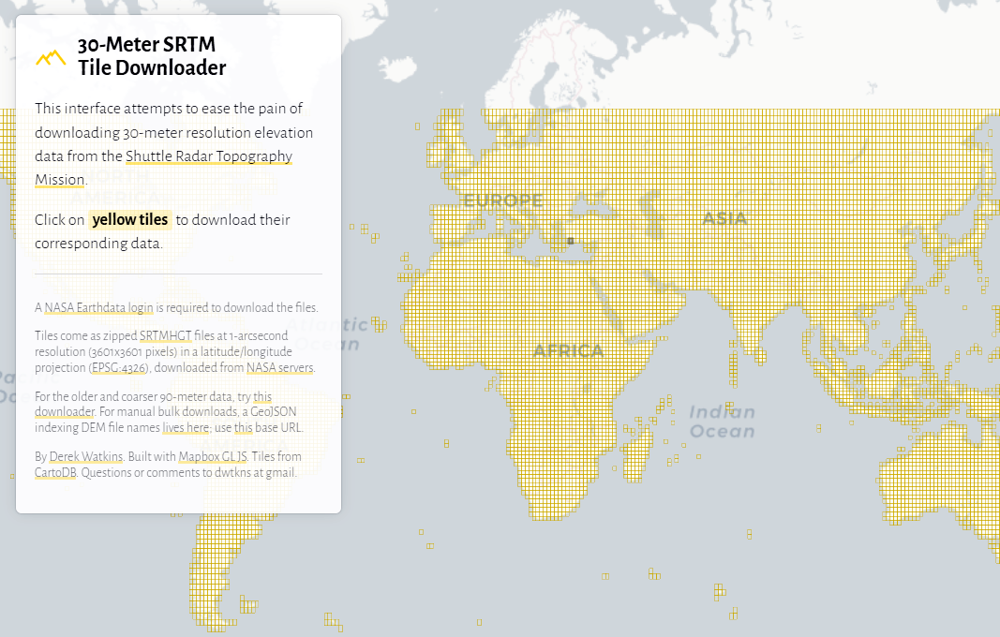
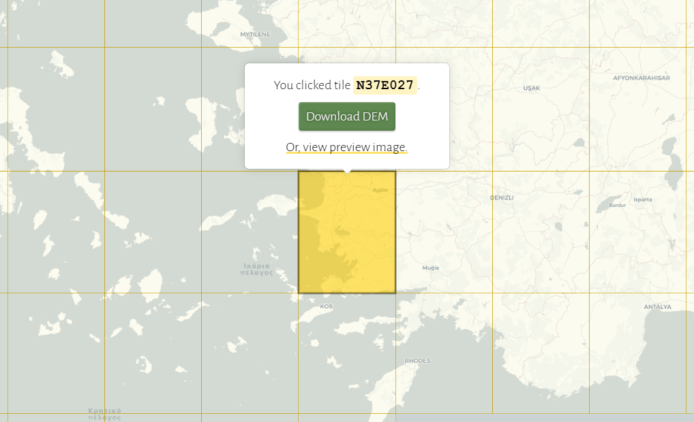
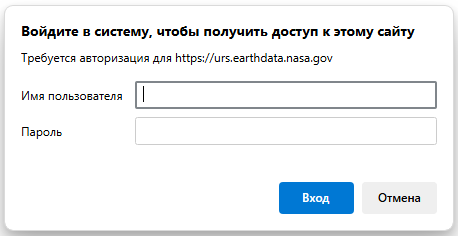
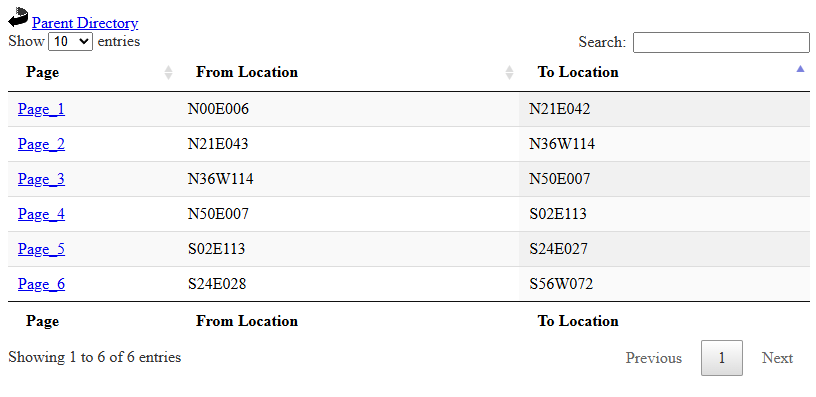
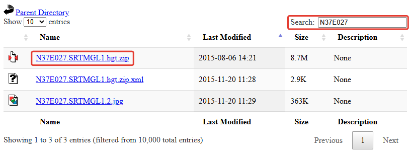

 
<!-- В строке ниже "../" - это переход к корню сайта. При этом текст "index.html" в пути можно и лучше опустить. После # - "подскок" к пункту "загрузка-цифровой-модели-рельефа" на главной странице. -->
◀️ [Вернуться на главную страницу](../#загрузка-цифровой-модели-рельефа)

 
Теперь, когда вы определились с районом работ и знаете идентификатор (номенклатуру) нужного тайла **цифровой модели рельефа** для создаваемой вами 3D&#8209;модели территории, 
необходимо загрузить себе на компьютер саму цифровую модель рельефа (ЦМР).
  
### Понятие ЦМР, существующие способы их создания и особенности представления

Цифровая модель рельефа, ЦМР (digital elevation model, DEM) — это средство трехмерного цифрового представления рельефа какой&#8209;либо местности. \
В простейшем варианте цифровые модели рельефа представляют собой совокупность значений высот земной поверхности, чаще всего в узлах регулярной сетки с образованием матрицы высот. \
Точность ЦМР определяется в первую очередь ее разрешением (горизонтальным расстоянием между узлами сетки или точками выборки). 
Основным способом цифрового представления рельефа в геоинформационных системах являются растровые форматы.

 
Источниками данных для создания цифровых моделей рельефа могут быть:
- цифровые топографические карты и планы территорий, содержащие информацию о высотных отметках, горизонталях и отдельных формах рельефа (обрывах, промоинах, насыпях и т.п.);
- стереопары космических снимков в оптическом диапазоне;
- стереопары аэрофотоснимков и снимков с беспилотных летательных аппаратов (БПЛА);
- данные радарной интерферометрии со спутников или пилотируемых аппаратов;
- данные воздушного и космического лазерного сканирования.

> Глобальные цифровые модели рельефа создаются, как правило, по данным космической радарной и стереосъемки.

 
В настоящее время в открытом доступе имеется множество разнообразных и полностью готовых к&nbsp;использованию **глобальных** ЦМР с разрешением в 1&quot; (угловую секунду) в одном пикселе
(это&nbsp;примерно 30&nbsp;метров вдоль меридианов и вдоль параллелей около экватора). \
Как правило, они представляют собой значения высот земной поверхности относительно эллипсоида **WGS&nbsp;84** в метрах.

Загрузить открытые глобальные цифровые модели рельефа можно со специальных порталов и через различные веб&#8209;каталоги пространственных данных. 
Это становится возможным после несложной предварительной регистрации пользователя.

Обычно, как продукт, глобальные ЦМР представляет собой набор файлов, каждый из которых покрывает территорию размером 1° на 1°. 
В названии каждого файла содержатся координаты левого нижнего угла соответствующего ему покрытия.
Сами же данные предоставляются в географической системе координат **EPSG:4326** (широта/долгота на эллипсоиде WGS&nbsp;84).
  
### Где можно найти и каким образом загрузить необходимую для работы ЦМР

В данном случае, для выполнения работы, вам предлагается использовать глобальную цифровую модель рельефа **Copernicus Global DSM 30m (GLO-30, COP30)**.

**Шаблон прямой ссылки:**

https://copernicus-dem-30m.s3.eu-central-1.amazonaws.com/
Copernicus_DSM_COG_10_**N80**_00_**E014**_00_DEM/
Copernicus_DSM_COG_10_**N80**_00_**E014**_00_DEM.tif

<!-- 
В данном случае, для выполнения работы, вам предлагается использовать глобальную цифровую модель рельефа **SRTM** (NASA Shuttle Radar Topography Mission) версии **SRTMGL1v003**. \
С подробным описанием цифровой модели рельефа SRTM, а также особенностями и преимуществами ее версии 3, можно ознакомиться на портале **NASA&nbsp;Earthdata** по 
   <a href="https://lpdaac.usgs.gov/products/srtmgl1v003" 
      title="Ссылка на сайт с описанием SRTMGL1v003" 
      target="_blank">
      <b>ссылке</b></a>.

Для загрузки самих данных SRTM вам необходимо пройти несложную регистрацию на портале NASA&nbsp;Earthdata, перейдя по ссылке 
   <a href="https://urs.earthdata.nasa.gov/users/new"
      title="Ссылка на страницу регистрации на портале NASA Earthdata"
      target="_blank">
      https://urs.earthdata.nasa.gov/users/new</a>. \
Завершив регистрацию и получив необходимые «Имя&nbsp;пользователя» (Username) и «Пароль» (Password), **обязательно** сохраните их себе в отдельный текстовый файл 
для последующего использования при загрузке размещенных на портале NASA&nbsp;Earthdata данных.

SRTM покрывает территорию, расположенную между **60°** северной широты и **56°** южной широты. \
Хотя это составляет около 80% всей суши Земли, важные северные территории планеты (включая обширные районы севера России) <u>данными SRTM не обеспечены</u>[^note].

Легко найти нужный вам тайл ЦМР SRTMGL1v003 и скачать соответствующий файл с портала NASA&nbsp;Earthdata можно с помощью удобного 
веб&#8209;сервиса «**30&#8209;Meter SRTM Tile Downloader**», перейдя к нему по ссылке
   <a href="https://dwtkns.com/srtm30m"
      title="Ссылка на сайт «30&#8209;Meter SRTM Tile Downloader»"
      target="_blank">
      <b>https://dwtkns.com/srtm30m</b></a>.

 
От пользователя требуется найти на карте необходимый тайл суши, щелкнуть по нему левой клавишей мыши, проверить в появившемся всплывающем меню идентификатор (номенклатуру) выбранного тайла 
и нажать кнопку «**Download&nbsp;DEM**» для загрузки соответствующей ЦМР[^note].

 
После этого откроется форма авторизации, в которой требуется ввести «Имя&nbsp;пользователя» и «Пароль», полученные вами ранее, необходимые для загрузки ЦМР с портала NASA&nbsp;Earthdata.

Завершите загрузку цифровой модели рельефа необходимого вам тайла, нажав кнопку «**Вход**».

**ZIP&#8209;архив** с ЦМР *(в моем примере это файл с именем «N37E027.SRTMGL1.hgt.zip»)* незамедлительно скачается в папку «**Загрузки**» (Downloads) на вашем компьютере.

В загруженном ZIP&#8209;архиве содержится один файл с расширением **\*.hgt** (от слова "height", высота) *(в&nbsp;моем примере он будет иметь имя «N37E027.hgt»)*.
Переместите ZIP&#8209;архив из папки «Загрузки» (Downloads) в вашу рабочую папку и извлеките в рабочую же папку hgt&#8209;файл с ЦМР из ZIP&#8209;архива.

Размер распакованного hgt&#8209;файла стандартного тайла ЦМР SRTM составляет примерно 25 Мбайт.
  
#### Альтернативный способ загрузки тайлов цифровой модели рельефа «SRTMGL1v003»
 
Если по каким&#8209;либо причинам страница веб&#8209;сервиса «30&#8209;Meter&nbsp;SRTM&nbsp;Tile&nbsp;Downloader» 
окажется недоступной — воспользуйтесь возможностью **прямой загрузки** файла необходимой вам ЦМР.

Зайдите по 
   <a href="https://e4ftl01.cr.usgs.gov/MEASURES/SRTMGL1.003/2000.02.11" 
      title="Ссылка для прямой загрузки SRTMGL1v003" 
      target="_blank">
      <b>ссылке</b></a>
на **US Government computer**.

На открывшейся странице, исходя из идентификатора (номенклатуры) тайла нужной вам ЦМР, перейдите к одной из шести страниц (папок) каталога:

*В моем примере для тайла N37E027 это будет страница&nbsp;3 (Page_3).*

Дождитесь **полной прогрузки** открывшейся страницы введите в окошке поиска (Search) идентификатор тайла вашей ЦМР *(в моем примере «N37E027»)*.

Для загрузки необходимого ZIP&#8209;архива с файлом вашей ЦМР щелкните по соответствующей ссылке правой клавишей мыши 
*(в моем примере «N37E027.SRTMGL1.hgt.zip»)*.
  

>#### *Важно:*
> <i>1\. При добавлении цифровой модели рельефа в ваш QGIS&#8209;проект перетягивайте на окно программы **именно распакованный** (то есть извлеченный из ZIP&#8209;архива) **hgt&#8209;файл** ЦМР, 
> а&nbsp;не&nbsp;изначально скаченный файл ZIP&#8209;архива.  
> При попытке открыть перетягиванием на окно QGIS предварительно скачанного ZIP&#8209;файла, программа может выдать **сообщение об&nbsp;ошибке**.</i>
> 
> <i>2\. Ни в коем случае **не переименовывайте** сам hgt&#8209;файл вашей цифровой модели рельефа (в моем примере «N37E027.hgt»).
> Иначе, при попытке открытия hgt&#8209;файла в QGIS, программа не сможет идентифицировать его как корректный файл ЦМР SRTM и, соответственно, прочитать его. 
> При этом QGIS выдаст сообщение об ошибке «Недействительный или неопознанный источник данных».</i>

 
#### Загрузка ЦМР «ALOS World 3D - 30m (AW3D30)», обеспечивающей полное покрытие всей суши
 
«ALOS Global Digital Surface Model» или «**ALOS World 3D - 30m (AW3D30)**» — глобальная модель рельефа, созданная на основе обработки более 3 миллионов изображений, 
полученных с помощью сенсора **PRISM** (Panchromatic Remote-sensing Instrument for Stereo Mapping) со спутника **ALOS** (Advanced Land Observing Satellite) за 2006–2011 годы. 
Ее разработчиком является Японское аэрокосмическое агентство JAXA. 
Изначально на основе данных ALOS была разработана ЦМР высокого пространственного разрешения (5 м), которая распространялась на коммерческой основе. \
С 2015 года загрубленная версия модели с пространственным разрешением в 1&quot; стала доступна для бесплатной загрузки после предварительной регистрации пользователя. \
Ее точность по высоте составляет около 5&nbsp;м, однако эта средняя оценка по всей площади суши не&nbsp;учитывает значительные погрешности в лесных зонах, обусловленные тем, 
что высоты лесного полога не отделены от высот рельефа. Таким образом, эти данные представляют собой цифровую модель **поверхности** (DSM), а не цифровую модель рельефа (DEM).

Важным преимуществом «ALOS World 3D - 30m (AW3D30)» является то, что она покрывает территорию, расположенную между **84°** северной широты и **84°** южной широты, 
обеспечивая глобальное покрытие всей поверхности суши нашей планеты. \
Таким образом, использование этой ЦМР позволит вам получить информацию о рельефе на **любую** интересующую вас территорию, включая районы необеспеченные данными ЦМР SRTM.

Для получения дополнительных сведений о характеристиках ЦМР «ALOS World 3D - 30m» и информации о ее **загрузке**, перейдите по 
   <a href="https://www.eorc.jaxa.jp/ALOS/en/dataset/aw3d30/aw3d30_e.htm" 
      title="Ссылка на сайт «ALOS World 3D - 30m (AW3D30)»" 
      target="_blank">
      <b>ссылке</b></a>. 
Информация, необходимая для загрузки данных AW3D30 *(включая ссылку на веб&#8209;сервис выбора и скачки нужных тайлов ЦМР, а также описание порядка регистрации пользователя)*, 
представлена на этой странице в **пункте&nbsp;4 (Download)**.

После загрузки ZIP&#8209;архива с данными ЦМР «ALOS World 3D - 30m», извлеките из него в вашу рабочую папку файл с именем, заканчивающимся на «**_DSM**» 
*(в моем примере это файл с именем «ALPSMLC30_N037E027_DSM.tif»)*. 
Именно в нем и будут представлены данные о высотах рельефа для загруженного вами тайла ЦМР «ALOS World 3D - 30m (AW3D30)».
 -->

<!-- 
ВАЖНАЯ ИНФОРМАЦИЯ:

Про NASA Global DEM (улучшенную SRTM) и ее прямую скачку с NASA Earthdata (US Government computer) смотри в документе "Прямая скачка SRTMGL1v003, NASA Global DEM и Copernicus Global DSM 30m.docx"
в ..\RUDN-QGIS-3D_full_set\RUDN-QGIS-3D\002 _ Скачка Цифровых Моделей Рельефа.

Там же смотри про Copernicus Global DSM 30m (как по мне - наилучшую по качеству и детальности DSM). Она между 84°N и 85°S.

Про ALOS World 3D – 30m (AW3D30) и ее прямую скачку с портала JAXA смотри в документе "Прямая скачка ALOS World 3D - 30m (AW3D30) - Моя регистрация на JAXA.docx"
в ..\RUDN-QGIS-3D_full_set\RUDN-QGIS-3D\002 _ Скачка Цифровых Моделей Рельефа.
Она между 84°N и 84°S.
 -->

[^note]: В случае отсутствия покрытия необходимого вам района данными ЦМР SRTM, обязательно обратитесь к преподавателю. Для обеспечения покрытие будут привлечены альтернативные варианты ЦМР (Copernicus&nbsp;DEM, ALOS&nbsp;World&nbsp;3D, FABDEM), гарантированно покрывающие нужную вам территорию.

 
  
 <!-- разделительная линия ======================================================== -->

 
🔼 [Наверх](./how_to_download_dem.html)
  
