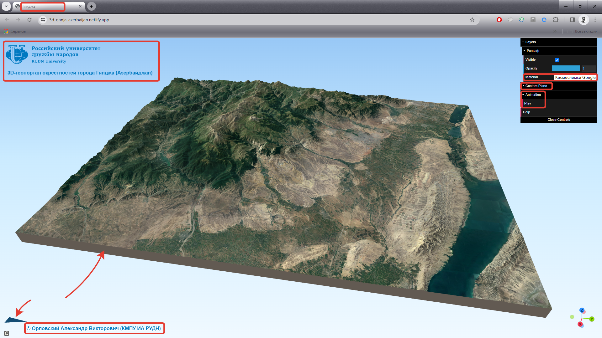

 
<!-- В строке ниже "../" - это переход к корню сайта. При этом текст "index.html" в пути можно и лучше опустить. После # - "подскок" к пункту "обязательный-самоконтроль-результатов-проделанной-работы" на главной странице. -->
◀️ [Вернуться на главную страницу](../#обязательный-самоконтроль-результатов-проделанной-работы)

 
Итоговым результатом вашей работы должна быть **веб&#8209;ссылка** на созданный вами и опубликованный на&nbsp;хостинге Netlify сайт с 3D&#8209;моделью выбранной вами территории. \
После выполнения обязательного самоконтроля, эту веб&#8209;ссылку вы должны отправить преподавателю личным сообщением в **MS&nbsp;Teams** или в **Яндекс&nbsp;Мессенджер**. \
Преподаватель проверит ваш результат и персонально каждому сообщит его итоговую оценку или&nbsp;даст рекомендации по желательной доработке 3D&#8209;модели и ее оформления.
  

### Следующие требования необходимо выполнить и соблюсти обязательно:
 
1\. Итоговая 3D&#8209;модель **должна** иметь высокий уровень детальности рельефа (со значением «**6**»).
  

2\. Текстурирующими рельеф изображениями (материалами) **необходимо** сделать следующие:

- Космический снимок высокого разрешения наилучшего качества для данной территории.

- Топографическую карту *(слой «Карта&nbsp;OpenTopoMap» или слой «Карта&nbsp;OSM&nbsp;Standard»)*.

- Цветной рельеф *(раскрашенный, в зависимости от высоты, цветовым градиентом)*.
  

> <i>Если «Космоснимки&nbsp;Google» (уже имеются в слоях исходной заготовки QGIS&#8209;проекта) на вашу территорию будут выглядеть не очень качественно 
(не выровненные по яркости и цвету мозаики снимков, облачность и т.п.), то обязательно попробуйте использовать другие доступные веб&#8209;сервисы с космоснимками.  
Для этого скачайте по [**ссылке**](https://alexander-orlovsky.github.io/RUDN-QGIS-3D-L1/materials/Дополнительные сервисы космоснимков.qlr) файл «**Дополнительные&nbsp;сервисы&nbsp;космоснимков.qlr**» 
и перетяните его на окно с картой вашего QGIS&#8209;проекта.
В результате в панель «Слои» добавится новая группа с названием «Дополнительные&nbsp;космоснимки», а в ней будет три слоя: «**Космоснимки&nbsp;Mapbox**», «**Космоснимки&nbsp;ESRI**» и «**Космоснимки&nbsp;Bing**».  
> 
> <i>Тщательно подберите и используйте для текстурирования рельефа тот слой, который даст наилучший итоговый результат.

 
Для текстурирующих рельеф изображений должны быть заданы следующие значения опции «**Image&nbsp;width&nbsp;(px)**», определяющей их детальность (разрешение на местности):

- для космических снимков &nbsp; &nbsp; &nbsp; &nbsp; &nbsp; &nbsp; **4096**;

- для топографической карты &nbsp; &nbsp; &nbsp; &nbsp; **2048**;

- для цветного рельефа &nbsp; &nbsp; &nbsp; &nbsp; &nbsp; &nbsp; &nbsp; &nbsp;**&nbsp;&nbsp;4096**.
  

3\. Для 3D&#8209;модели должен быть создан изящный (не толстый и не тонкий) «**бортик**». \
При этом «бортик» должен быть аккуратно “подрезан” со всех четырех сторон 3D&#8209;модели 
путем&nbsp;округления ее размеров по горизонтальным осям *(параметры «Width» и «Height»)* до&nbsp;1000&nbsp;(тысяч&nbsp;метров) в сторону уменьшения.
  

4\. Координаты в итоговой 3D&#8209;веб&#8209;модели должны измеряться в **градусах/минутах/секундах**.
  

5\. В итоговой веб&#8209;странице с 3D&#8209;моделью должно быть меню в верхнем правом ее углу. \
Для этого при экспорте в веб задается шаблон (Template) именно «**3D&nbsp;Viewer&nbsp;with&nbsp;dat&#8209;gui&nbsp;panel**».
  

6\. В указанном выше меню обязательно должно присутствовать подменю «**Custom&nbsp;Plane**» 
(оно дает возможность создавать горизонтальную плоскость задаваемой вами высоты, цвета и прозрачности). 
Для этого при экспорте в веб в блоке Template требовалось включить опцию «Custom&nbsp;plane», поставив галочку в соответствующем чек&#8209;боксе.
  

7\. В итоговой веб&#8209;странице **обязательно** должны присутствовать **красивые**&nbsp;колонтитулы 
(на&nbsp;основе имеющихся html&#8209;шаблонов, с логотипом РУДН, без каких-либо некорректных смещений).

- Верхний колонтитул должен содержать логотип РУДН и информацию о географическом расположении (или названии) территории вашей 3D&#8209;модели и стране ее локации.

- Нижний колонтитул — ваши ФИО **полностью**, а **в скобках** код вашей учебной группы.
  

8\. На сайте должна присутствовать динамическая **стрелка**, указывающая направление на Север.
  

9\. Должна быть создана эффектная **анимация** пролета над территорией вашей 3D&#8209;модели. \
Анимация должна начинать плавное движение с выбранного вами начального ракурса (ориентации) 
и именно этот ракурс должен быть задан для 3D&#8209;модели при открытии ее веб&#8209;страницы в браузере. 
Маршрут анимации (виртуального пролета) должен быть замкнутым — анимация пролета должна вернуться в конце в свою исходную точку (к начальному ракурсу). \
Анимация должна быть **НЕ** зацикленной — после возвращения в исходную точку она должна остановиться и повторяться только после повторного ее запуска.
  

10\. В анимации должен присутствовать хотя бы один **стоп&#8209;кадр**, фокусирующий внимание зрителя на каком&#8209;либо важном для данной территории географическом объекте. \
Для этого стоп-кадра должно быть создано «**Повествовательное содержание**», включающее фотографию объекта и его краткое описание в html&#8209;формате. \
«Повествовательное содержание» стоп&#8209;кадра должно быть создано на основе включенных в описание порядка работы шаблонов (html&#8209;заготовок) **№&nbsp;2** *(средней сложности, с веб&#8209;ссылкой)* 
или&nbsp;**№&nbsp;3** *(более сложный, с веб&#8209;ссылкой)*. 
> Шаблон&nbsp;**№&nbsp;1** *(самый простой)* служит **только** для первичного ознакомления с базовым html&#8209;синтаксисом и для оформления **дополнительных** стоп&#8209;кадров в вашей анимации.

  
В качестве образца итогового результата вам рекомендуется ориентироваться на подготовленный преподавателем сайт 
   <a href="https://3d-ganja-azerbaijan.netlify.app" 
      title="Ссылка на сайт с примером 3D&#8209;геопортала" 
      target="_blank">
      «3D&#8209;геопортал окрестностей города Гянджа (Азербайджан)»</a>. \
В указанном примере сайта (геопортала с 3D&#8209;моделью) присутствует все элементы, которые **обязательно** должны быть представлены и в вашем итоговом результате.

На рисунке ниже важные элементы итоговой html&#8209;веб&#8209;страницы с 3D&#8209;моделью отмечены красным:
  
   <a href="../media/Важные_элементы_геопротала.png"
      target="_blank">
      
   <a>

*Увеличить рисунок можно щелкнув по нему левой клавишей мыши (откроется в новой вкладке).*

 
  
 <!-- разделительная линия ======================================================== -->
 
🔼 [Наверх](./mandatory_self_check.html)
 
